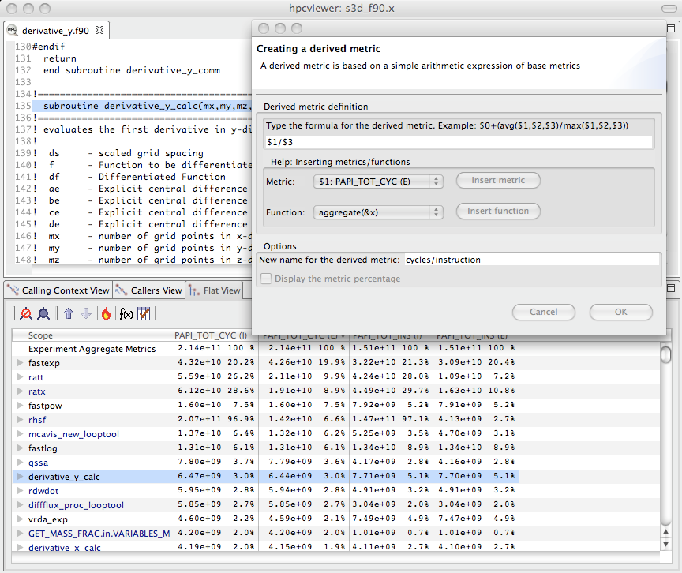
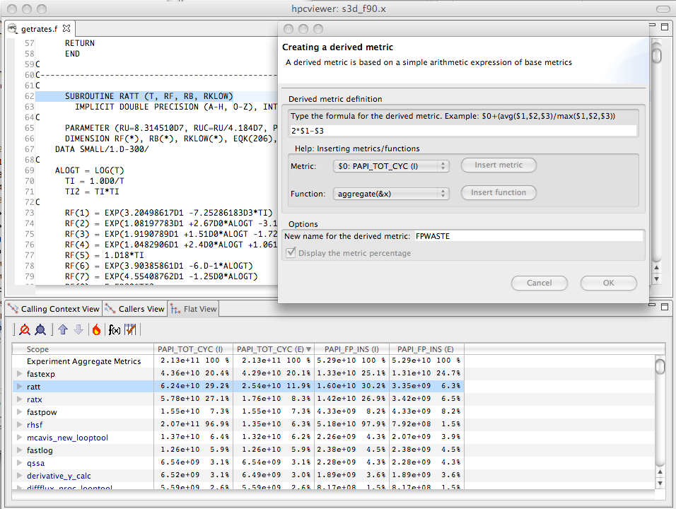

<!--
SPDX-FileCopyrightText: 2002-2023 Rice University
SPDX-FileCopyrightText: 2024 Contributors to the HPCToolkit Project

SPDX-License-Identifier: CC-BY-4.0
-->

(chpt:effective-performance-analysis)=

# Effective Strategies for Analyzing Program Performance

This chapter describes some proven strategies for using performance measurements to identify performance bottlenecks in both serial and parallel codes.

## Monitoring High-Latency Penalty Events

A very simple and often effective methodology is to profile with respect to cycles and high-latency penalty events.
If HPCToolkit attributes a large number of penalty events with a particular source-code statement, there is an extremely high likelihood of significant exposed stalling.
This is true even though (1) modern out-of-order processors can overlap the stall latency of one instruction with nearby independent instructions and (2) some penalty events "over count".
[^4]
If a source-code statement incurs a large number of penalty events and it also consumes a non-trivial amount of cycles, then this region of code is an opportunity for optimization.
Examples of good penalty events are last-level cache misses and TLB misses.

## Computing Derived Metrics

Modern computer systems provide access to a rich set of hardware performance counters that can directly measure various aspects of a program's performance.
Counters in the processor core and memory hierarchy enable one to collect measures of work (e.g., operations performed), resource consumption (e.g., cycles), and inefficiency (e.g., stall cycles).
One can also measure time using system timers.

Values of individual metrics are of limited use by themselves.
For instance, knowing the count of cache misses for a loop or routine is of little value by itself; only when combined with other information such as the number of instructions executed or the total number of cache accesses does the data become informative.
While a developer might not mind using mental arithmetic to evaluate the relationship between a pair of metrics for a particular program scope (e.g., a loop or a procedure), doing this for many program scopes is exhausting.
To address this problem, `hpcviewer` supports calculation of derived metrics.
`hpcviewer` provides an interface that enables a user to specify spreadsheet-like formula that can be used to calculate a derived metric for every program scope.

```{figure-md} fig:cycles-per-inst


Computing a derived metric (cycles per instruction) in `hpcviewer`.
```

Figure [4.1](#fig:cycles-per-inst) shows how to use `hpcviewer` to compute a *cycles*/*instruction* derived metric from measured metrics `PAPI_TOT_CYC` and `PAPI_TOT_INS`; these metrics correspond to *cycles* and *total instructions executed* measured with the PAPI hardware counter interface.
To compute a derived metric, one first depresses the button marked `f(x)` above the metric pane; that will cause the pane for computing a derived metric to appear.
Next, one types in the formula for the metric of interest.
When specifying a formula, existing columns of metric data are referred to using a positional name `$n` to refer to the `n`th column, where the first column is written as `$0`.
The metric pane shows the formula `$1/$3`.
Here, `$1` refers to the column of data representing the exclusive value for `PAPI_TOT_CYC` and `$3` refers to the column of data representing the exclusive value for `PAPI_TOT_INS`.
[^5]
Positional names for metrics you use in your formula can be determined using the *Metric* pull-down menu in the pane.
If you select your metric of choice using the pull-down, you can insert its positional name into the formula using the *insert metric* button, or you can simply type the positional name directly into the formula.

```{figure-md} fig:cycles-per-inst-2


Displaying the new *cycles/ instruction* derived metric in `hpcviewer`.
```

At the bottom of the derived metric pane, one can specify a name for the new metric.
One also has the option to indicate that the derived metric column should report for each scope what percent of the total its quantity represents; for a metric that is a ratio, computing a percent of the total is not meaningful, so we leave the box unchecked.
After clicking the OK button, the derived metric pane will disappear and the new metric will appear as the rightmost column in the metric pane.
If the metric pane is already filled with other columns of metric, you may need to scroll right in the pane to see the new metric.
Alternatively, you can use the metric check-box pane (selected by depressing the button to the right of `f(x)` above the metric pane) to hide some of the existing metrics so that there will be enough room on the screen to display the new metric.
Figure [4.2](#fig:cycles-per-inst-2) shows the resulting `hpcviewer` display after clicking OK to add the derived metric.

The following sections describe several types of derived metrics that are of particular use to gain insight into performance bottlenecks and opportunities for tuning.

(sec:effective-performance-analysis:inefficiencies)=

## Pinpointing and Quantifying Inefficiencies

While knowing where a program spends most of its time or executes most of its floating point operations may be interesting, such information may not suffice to identify the biggest targets of opportunity for improving program performance.
For program tuning, it is less important to know how much resources (e.g., time, instructions) were consumed in each program context than knowing where resources were consumed *inefficiently*.

To identify performance problems, it might initially seem appealing to compute ratios to see how many events per cycle occur in each program context.
For instance, one might compute ratios such as FLOPs/cycle, instructions/cycle, or cache miss ratios.
However, using such ratios as a sorting key to identify inefficient program contexts can misdirect a user's attention.
There may be program contexts (e.g., loops) in which computation is terribly inefficient (e.g., with low operation counts per cycle); however, some or all of the least efficient contexts may not account for a significant amount of execution time.
Just because a loop is inefficient doesn't mean that it is important for tuning.

The best opportunities for tuning are where the aggregate performance losses are greatest.
For instance, consider a program with two loops.
The first loop might account for 90% of the execution time and run at 50% of peak performance.
The second loop might account for 10% of the execution time, but only achieve 12% of peak performance.
In this case, the total performance loss in the first loop accounts for 50% of the first loop's execution time, which corresponds to 45% of the total program execution time.
The 88% performance loss in the second loop would account for only 8.8% of the program's execution time.
In this case, tuning the first loop has a greater potential for improving the program performance even though the second loop is less efficient.

A good way to focus on inefficiency directly is with a derived *waste* metric.
Fortunately, it is easy to compute such useful metrics.
However, there is no one *right* measure of waste for all codes.
Depending upon what one expects as the rate-limiting resource (e.g., floating-point computation, memory bandwidth, etc.), one can define an appropriate waste metric (e.g., FLOP opportunities missed, bandwidth not consumed) and sort by that.

```{figure-md} fig:fpwaste


Computing a floating point waste metric in `hpcviewer`.
```

For instance, in a floating-point intensive code, one might consider keeping the floating point pipeline full as a metric of success.
One can directly quantify and pinpoint losses from failing to keep the floating point pipeline full *regardless of why this occurs*.
One can pinpoint and quantify losses of this nature by computing a *floating-point waste* metric that is calculated as the difference between the potential number of calculations that could have been performed if the computation was running at its peak rate minus the actual number that were performed.
To compute the number of calculations that could have been completed in each scope, multiply the total number of cycles spent in the scope by the peak rate of operations per cycle.
Using `hpcviewer`, one can specify a formula to compute such a derived metric and it will compute the value of the derived metric for every scope.
Figure [4.3](#fig:fpwaste) shows the specification of this floating-point waste metric for a code.[^6]

Sorting by a waste metric will rank order scopes to show the scopes with the greatest waste.
Such scopes correspond directly to those that contain the greatest opportunities for improving overall program performance.
A waste metric will typically highlight loops where

- a lot of time is spent computing efficiently, but the aggregate inefficiencies accumulate,

- less time is spent computing, but the computation is rather inefficient, and

- scopes such as copy loops that contain no computation at all, which represent a complete waste according to a metric such as floating point waste.

```{figure-md} fig:fpefficiency


Computing floating point efficiency in percent using `hpcviewer`.
```

Beyond identifying and quantifying opportunities for tuning with a waste metric, one can compute a companion derived metric *relative efficiency* metric to help understand how easy it might be to improve performance.
A scope running at very high efficiency will typically be much harder to tune than running at low efficiency.
For our floating-point waste metric, we one can compute the floating point efficiency metric by dividing measured FLOPs by potential peak FLOPs and multiplying the quantity by 100.
Figure [4.4](#fig:fpefficiency) shows the specification of this floating-point efficiency metric for a code.

```{figure-md} fig:fpefficiency-loop


Using floating point waste and the percent of floating point efficiency to evaluate opportunities for optimization.
```

Scopes that rank high according to a waste metric and low according to a companion relative efficiency metric often make the best targets for optimization.
Figure [4.5](#fig:fpefficiency-loop) shows the specification of this floating-point efficiency metric for a code.
Figure [4.5](#fig:fpefficiency-loop) shows an `hpcviewer` display that shows the top two routines that collectively account for 32.2% of the floating point waste in a reactive turbulent combustion code.
The second routine (`ratt`) is expanded to show the loops and statements within.
While the overall floating point efficiency for `ratt` is at 6.6% of peak (shown in scientific notation in the `hpcviewer` display), the most costly loop in `ratt` that accounts for 7.3% of the floating point waste is executing at only 0.114% efficiency.
Identifying such sources of inefficiency is the first step towards improving performance via tuning.

(sec:effective-performance-analysis:scalability)=

## Pinpointing and Quantifying Scalability Bottlenecks

On large-scale parallel systems, identifying impediments to scalability is of paramount importance.
On today's systems fashioned out of multicore processors, two kinds of scalability are of particular interest:

- scaling within nodes, and

- scaling across the entire system.

HPCToolkit can be used to readily pinpoint both kinds of bottlenecks.
Using call path profiles collected by `hpcrun`, it is possible to quantify and pinpoint scalability bottlenecks of any kind, *regardless of cause*.

To pinpoint scalability bottlenecks in parallel programs, we use *differential profiling* --- mathematically combining corresponding buckets of two or more execution profiles.
Differential profiling was first described by McKenney (McKenney 1999); he used differential profiling to compare two *flat* execution profiles.
Differencing of flat profiles is useful for identifying what parts of a program incur different costs in two executions.
Building upon McKenney's idea of differential profiling, we compare call path profiles of parallel executions at different scales to pinpoint scalability bottlenecks.
Differential analysis of call path profiles pinpoints not only differences between two executions (in this case scalability losses), but the contexts in which those differences occur.
Associating changes in cost with full calling contexts is particularly important for pinpointing context-dependent behavior.
Context-dependent behavior is common in parallel programs.
For instance, in message passing programs, the time spent by a call to `MPI_Wait` depends upon the context in which it is called.
Similarly, how the performance of a communication event scales as the number of processors in a parallel execution increases depends upon a variety of factors such as whether the size of the data transferred increases and whether the communication is collective or not.

### Scalability Analysis Using Expectations

Application developers have expectations about how the performance of their code should scale as the number of processors in a parallel execution increases.
Namely,

- when different numbers of
  processors are used to solve the same problem (strong scaling), one
  expects an execution's speedup to increase linearly with the number of processors employed;

- when
  different numbers of processors are used but the amount of computation
  per processor is held constant (weak scaling), one expects the execution
  time on a different number of processors to be the same.

In both of these situations, a code developer can express their expectations for how performance will scale as a formula that can be used to predict execution performance on a different number of processors.
One's expectations about how overall application performance should scale can be applied to each context in a program
to pinpoint and quantify deviations from expected scaling.
Specifically, one can scale and difference the performance of an application on different numbers of processors to pinpoint contexts that are not scaling ideally.

To pinpoint and quantify scalability bottlenecks in a parallel application, we first use `hpcrun` to a collect call path profile for an application on two different numbers of processors.
Let `E_p` be an execution on `p` processors and `E_q` be an execution on `q` processors.
Without loss of generality, assume that `q > p`.

In our analysis, we consider both *inclusive* and *exclusive* costs for CCT nodes.
The inclusive cost at `n` represents the sum of all costs attributed to `n` and any of its descendants in the CCT, and is denoted by `I(n)`.
The exclusive cost at `n` represents the sum of all costs attributed strictly to `n`, and we denote it by `E(n)`.
If `n` is an interior node in a CCT, it represents an invocation of a procedure.
If `n` is a leaf in a CCT, it represents a statement inside some procedure. For leaves, their inclusive and exclusive costs are equal.

It is useful to perform scalability analysis for both inclusive and exclusive costs; if the loss of scalability attributed to the inclusive costs of a function invocation is roughly equal to the loss of scalability due to its exclusive costs, then we know that the computation in that function invocation does not scale.
However, if the loss of scalability attributed to a function invocation's inclusive costs outweighs the loss of scalability accounted for by exclusive costs, we need to explore the scalability of the function's callees.

Given CCTs for an ensemble of executions, the next step to analyzing the scalability of their performance is to clearly define our expectations.
Next, we describe performance expectations for weak scaling and intuitive metrics that represent how much performance deviates from our expectations.
More information about our scalability analysis technique can be found elsewhere (Coarfa et al. 2007; N. R. Tallent et al. 2009).

```{figure-md} fig:scaling-loss


Computing the scaling loss when weak scaling a white dwarf detonation simulation with FLASH3 from 256 to 8192 cores. For weak scaling, the time on an MPI rank in each of the simulations will be the same. In the figure, column 0 represents the inclusive cost for one MPI rank in a 256-core simulation; column 2 represents the inclusive cost for one MPI rank in an 8192-core simulation. The difference between these two columns, computed as `$2-$0`,
represents the excess work present in the larger simulation for each unique program context in the calling context tree. Dividing that by the total time in the 8192-core execution `@2` gives the fraction of wasted time. Multiplying through by 100 gives the percent of the time wasted in the 8192-core execution, which corresponds to the % scalability loss.
```

```{figure-md} fig:scaling-loss-2


Using the fraction the scalability loss metric of Figure [4.6](#fig:scaling-loss) to rank order loop nests by their scaling loss.
```

#### Weak Scaling

Consider two weak scaling experiments executed on `p` and `q` processors, respectively, `p < q`.
In Figure [4.6](#fig:scaling-loss) shows how we can use a derived metric to compute and attribute scalability losses.
Here, we compute the difference in inclusive cycles spent on one core of a 8192-core run and one core in a 256-core run in a weak scaling experiment.
If the code had perfect weak scaling, the time for an MPI rank in each of the executions would be identical. In this case, they are not.
We compute the excess work by computing the difference for each scope between the time on the 8192-core run and the time on the 256-core core run.
We normalize the differences of the time spent in the two runs by dividing then by the total time spent on the 8192-core run. This yields the fraction of wasted effort
for each scope when scaling from 256 to 8192 cores. Finally, we multiply these results by 100 to compute the % scalability loss.
This example shows how one can compute a derived metric to that pinpoints and quantifies scaling losses across different node counts of a Blue Gene/P system.

A similar analysis can be applied to compute scaling losses between jobs that use different numbers of core counts on individual processors.
Figure [4.7](#fig:scaling-loss-2) shows the result of computing the scaling loss for each loop nest when scaling from one to eight cores on a multicore node and rank order loop nests by their scaling loss metric. Here, we simply compute the scaling loss as the difference between the cycle counts of the eight-core and the one-core runs, divided through by the aggregate cost of the process executing on eight cores. This figure shows the scaling lost written in scientific notation as a fraction rather than multiplying through by 100 to yield a percent.
In this figure, we examine scaling losses in the flat view, showing them for each loop nest.
The source pane shows the loop nest responsible for the greatest scaling loss when scaling from one to eight cores.
Unsurprisingly, the loop with the worst scaling loss is very memory intensive.
Memory bandwidth is a precious commodity on multicore processors.

While we have shown how to compute and attribute the fraction of excess work in a weak scaling experiment, one can compute a similar quantity for experiments with strong scaling. When differencing the costs summed across all of the threads in a pair of strong-scaling experiments, one uses exactly the same approach as shown in Figure [4.6](#fig:scaling-loss). If comparing weak scaling costs summed across all ranks in `p` and `q` core executions, one can simply scale the aggregate costs by `1/p` and `1/q` respectively before differencing them.

#### Exploring Scaling Losses

Scaling losses can be explored in `hpcviewer` using any of its three views.

- *Top-down view.* This view represents the dynamic calling contexts (call paths) in which costs were incurred.

- *Bottom-up view.* This view enables one to look upward along call paths. This view is particularly useful for understanding the performance of software components or procedures that are used in more than one context, such as communication library routines.

- *Flat view.* This view organizes performance measurement data according to the static structure of an application. All costs incurred in *any* calling context by a procedure are aggregated together in the flat view.

`hpcviewer` enables developers to explore top-down, bottom-up, and flat views of CCTs annotated with costs, helping to quickly pinpoint performance bottlenecks.
Typically, one begins analyzing an application's scalability and performance using the top-down calling context tree view.
Using this view, one can readily see how costs and scalability losses are associated with different calling contexts.
If costs or scalability losses are associated with only a few calling contexts, then this view suffices for identifying the bottlenecks.
When scalability losses are spread among many calling contexts, e.g., among different invocations of `MPI_Wait`, often it is useful to switch to the bottom-up of the data to see if many losses are due to the same underlying cause.
In the bottom-up view, one can sort routines by their exclusive scalability losses and then look upward to see how these losses accumulate from the different calling contexts in which the routine was invoked.

Scaling loss based on excess work is intuitive; perfect scaling corresponds to a excess work value of 0, sublinear scaling yields positive values, and superlinear scaling yields negative values.
Typically, CCTs for SPMD programs have similar structure.
If CCTs for different executions diverge, using `hpcviewer` to compute and report excess work will highlight these program regions.

Inclusive excess work and exclusive excess work serve as useful measures of scalability associated with nodes in a calling context tree (CCT).
By computing both metrics, one can determine whether the application scales well or not at a CCT node and also pinpoint the cause of any lack of scaling.
If a node for a function in the CCT has comparable positive values for both inclusive excess work and exclusive excess work, then the loss of scaling is due to computation in the function itself.
However, if the inclusive excess work for the function outweighs that accounted for by its exclusive costs, then one should explore the scalability of its callees.
To isolate code that is an impediment to scalable performance, one can use the *hot path* button in `hpcviewer` to trace a path down through the CCT to see where the cost is incurred.

[^4]: For example, performance monitoring units often categorize a prefetch as a cache miss.

[^5]: An *exclusive* metric for a scope refers to the quantity of the metric measured for that scope alone; an *inclusive* metric for a scope represents the value measured for that scope as well as costs incurred by any functions it calls. In `hpcviewer`, inclusive metric columns are marked with "(I)" and exclusive metric columns are marked with "(E)."

[^6]: Many recent processors have trouble accurately counting floating-point operations accurately, which is unfortunate. If your processor can't accurately count floating-point operations, a floating-point waste metric will be less useful.
