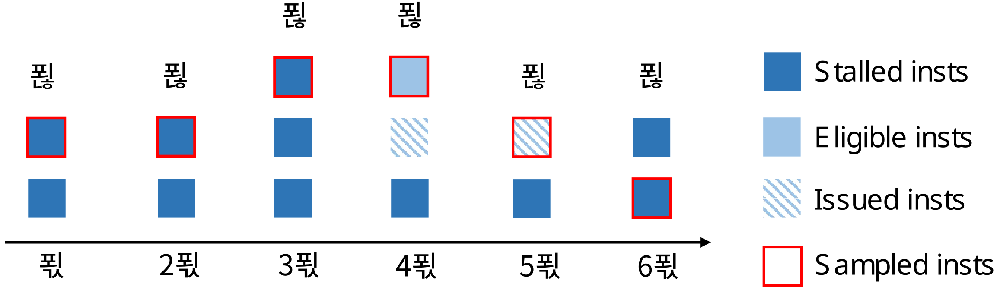
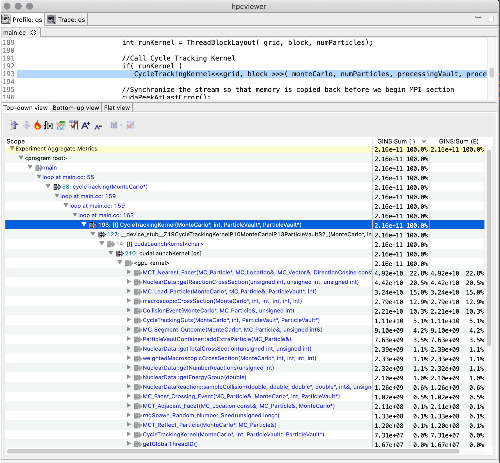
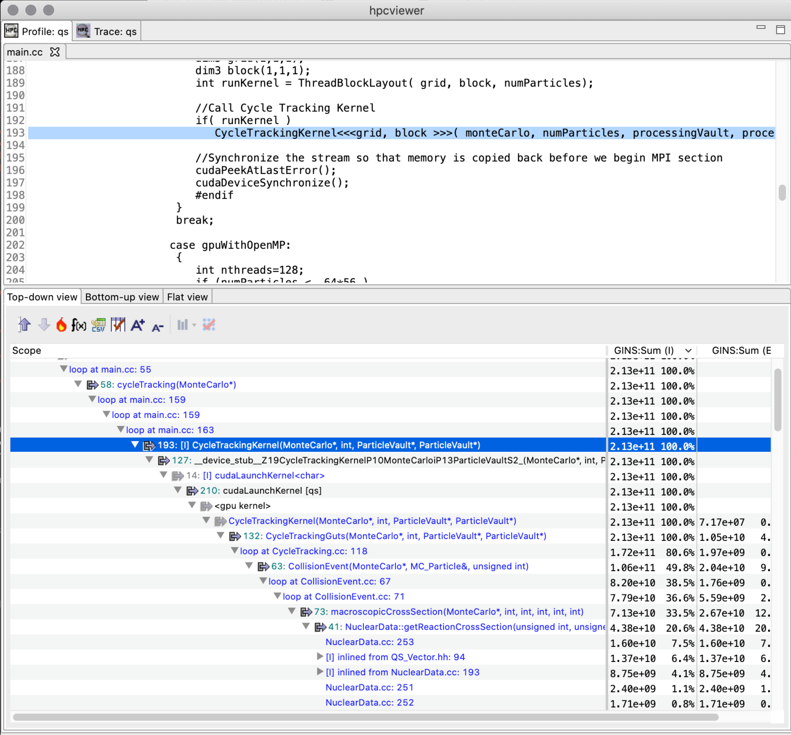

<!--
SPDX-FileCopyrightText: 2002-2023 Rice University
SPDX-FileCopyrightText: 2024 Contributors to the HPCToolkit Project

SPDX-License-Identifier: CC-BY-4.0
-->

(chpt:gpu)=

# Measurement and Analysis of GPU-accelerated Applications

HPCToolkit can measure both the CPU and GPU performance of GPU-accelerated applications. It can measure CPU performance using asynchronous sampling triggered by Linux timers or hardware counter events as described in
Section [5.3](#sample-sources) and it can monitor GPU performance using tool support libraries provided by GPU vendors.

In the following sections, we describe a generic substrate in HPCToolkit to interact with vendor specific runtime systems and libraries and the vendor specific details for measuring performance for NVIDIA, AMD, and Intel GPUs.

While a single version of HPCToolkit can be built that supports GPUs from multiple vendors and programming models, using HPCToolkit to collect GPU metrics using GPUs from multiple vendors in a single execution or using multiple GPU programming models (e.g. CUDA + OpenCL) in a single execution is unsupported. It is unlikely to produce correct measurements and likely to crash.

## GPU Performance Measurement Substrate

HPCToolkit's measurement subsystem supports both profiling and tracing of GPU activities. We discuss the support for profiling and tracing in the following subsections.

### Profiling GPU Activities

The foundation of HPCToolkit's support for measuring the performance of GPU-accelerated applications is a vendor-independent monitoring substrate. A thin software layer connects NVIDIA's CUPTI (CUDA Performance Tools Interface) (NVIDIA Corporation 2019) and AMD's ROC-tracer (ROCm Tracer Callback/Activity Library) (Advanced Micro Devices, n.d.) monitoring libraries to this substrate. The substrate also includes function wrappers to intercept calls to the OpenCL API and Intel's Level 0 API to measure GPU performance for programming models that do not have an integrated measurement substrate
such as CUPTI or ROC-tracer.
HPCToolkit reports GPU performance metrics in a vendor-neutral way. For instance, rather than focusing on NVIDIA warps or AMD wavefronts, HPCToolkit presents both as fine-grain, thread-level parallelism.

HPCToolkit supports two levels of performance monitoring for GPU accelerated applications: coarse-grain profiling and tracing of GPU activities at the operation level (e.g., kernel launches, data allocations, memory copies, ...), and fine-grain measurement of GPU computations using PC sampling or instrumentation, which measure GPU computations at the granularity of individual machine instructions.

Coarse-grain profiling attributes to each calling context the total time of all GPU operations initiated in that context. Table [8.1](#table:gtimes) shows the classes of GPU operations for which timings are collected. In addition, HPCToolkit records metrics for operations performed including memory allocation and deallocation (Table [8.2](#table:gmem)), memory set (Table [8.3](#table:gmset)), explicit memory copies (Table [8.4](#table:gxcopy)), and synchronization (Table [8.5](#table:gsync)). These operation metrics are available for GPUs from all three vendors.
For NVIDIA GPUs, HPCToolkit also reports GPU kernel characteristics, including including register usage, thread count per block, and theoretical occupancy as shown in Table [8.6](#table:gker). HPCToolkit derives a theoretical GPU occupancy metric as the ratio of the active threads in a streaming multiprocessor to the maximum active threads supported by the hardware in one streaming multiprocessor.

Table [8.7](#table:pc-stall) shows fine-grain metrics for GPU instruction execution.
When possible, HPCToolkit attributes fine-grain GPU metrics to both GPU calling contexts and CPU calling contexts.
To our knowledge, no GPU has hardware support for attributing metrics directly to GPU calling contexts.
To compensate, HPCToolkit approximates attributes metrics to GPU calling contexts. It reconstructs GPU calling contexts from static GPU call graphs for
NVIDIA GPUs (See Section [8.2.4](#nvidia-cct)) and uses measurements of call sites and data flow analysis on static call graphs to apportion metrics among call paths in a GPU calling context tree.
We expect to add similar functionality for GPUs from other vendors in the future.

The performance metrics above are reported in a vendor-neutral way. Not every metric is available for all GPUs.
Coarse-grain profiling and tracing are supported for AMD, Intel, and NVIDIA GPUs. HPCToolkit supports fine-grain measurements on NVIDIA GPUs using PC sampling and provides some simple fine-grain measurements on Intel GPUs using instrumentation.
Currently, AMD GPUs lack both hardware and software support for fine-grain measurement. The next few sections describe specific measurement capabilities for NVIDIA, AMD, and Intel GPUs, respectively.

```{table} GPU operation timings.
---
name: table:gtimes
---
| Metric       | Description                                        |
| :----------- | :------------------------------------------------- |
| GKER (sec)   | GPU time: kernel execution (seconds)               |
| GMEM (sec)   | GPU time: memory allocation/deallocation (seconds) |
| GMSET (sec)  | GPU time: memory set (seconds)                     |
| GXCOPY (sec) | GPU time: explicit data copy (seconds)             |
| GSYNC (sec)  | GPU time: synchronization (seconds)                |
| GPUOP (sec)  | Total GPU operation time: sum of all metrics above |
```

```{table} GPU memory allocation and deallocation.
---
name: table:gmem
---
| Metric       | Description                                          |
| :----------- | :--------------------------------------------------- |
| GMEM:UNK (B) | GPU memory alloc/free: unknown memory kind (bytes)   |
| GMEM:PAG (B) | GPU memory alloc/free: pageable memory (bytes)       |
| GMEM:PIN (B) | GPU memory alloc/free: pinned memory (bytes)         |
| GMEM:DEV (B) | GPU memory alloc/free: device memory (bytes)         |
| GMEM:ARY (B) | GPU memory alloc/free: array memory (bytes)          |
| GMEM:MAN (B) | GPU memory alloc/free: managed memory (bytes)        |
| GMEM:DST (B) | GPU memory alloc/free: device static memory (bytes)  |
| GMEM:MST (B) | GPU memory alloc/free: managed static memory (bytes) |
| GMEM:COUNT   | GPU memory alloc/free: count                         |
```

```{table} GPU memory set metrics.
---
name: table:gmset
---
| Metric        | Description                                   |
| :------------ | :-------------------------------------------- |
| GMSET:UNK (B) | GPU memory set: unknown memory kind (bytes)   |
| GMSET:PAG (B) | GPU memory set: pageable memory (bytes)       |
| GMSET:PIN (B) | GPU memory set: pinned memory (bytes)         |
| GMSET:DEV (B) | GPU memory set: device memory (bytes)         |
| GMSET:ARY (B) | GPU memory set: array memory (bytes)          |
| GMSET:MAN (B) | GPU memory set: managed memory (bytes)        |
| GMSET:DST (B) | GPU memory set: device static memory (bytes)  |
| GMSET:MST (B) | GPU memory set: managed static memory (bytes) |
| GMSET:COUNT   | GPU memory set: count                         |
```

```{table} GPU explicit memory copy metrics.
---
name: table:gxcopy
---
| Metric         | Description                                        |
| :------------- | :------------------------------------------------- |
| GXCOPY:UNK (B) | GPU explicit memory copy: unknown kind (bytes)     |
| GXCOPY:H2D (B) | GPU explicit memory copy: host to device (bytes)   |
| GXCOPY:D2H (B) | GPU explicit memory copy: device to host (bytes)   |
| GXCOPY:H2A (B) | GPU explicit memory copy: host to array (bytes)    |
| GXCOPY:A2H (B) | GPU explicit memory copy: array to host (bytes)    |
| GXCOPY:A2A (B) | GPU explicit memory copy: array to array (bytes)   |
| GXCOPY:A2D (B) | GPU explicit memory copy: array to device (bytes)  |
| GXCOPY:D2A (B) | GPU explicit memory copy: device to array (bytes)  |
| GXCOPY:D2D (B) | GPU explicit memory copy: device to device (bytes) |
| GXCOPY:H2H (B) | GPU explicit memory copy: host to host (bytes)     |
| GXCOPY:P2P (B) | GPU explicit memory copy: peer to peer (bytes)     |
| GXCOPY:COUNT   | GPU explicit memory copy: count                    |
```

```{table} GPU synchronization metrics.
---
name: table:gsync
---
| Metric           | Description                             |
| :--------------- | :-------------------------------------- |
| GSYNC:UNK (sec)  | GPU synchronizations: unknown kind      |
| GSYNC:EVT (sec)  | GPU synchronizations: event             |
| GSYNC:STRE (sec) | GPU synchronizations: stream event wait |
| GSYNC:STR (sec)  | GPU synchronizations: stream            |
| GSYNC:CTX (sec)  | GPU synchronizations: context           |
| GSYNC:COUNT      | GPU synchronizations: count             |
```

```{table} GPU kernel characteristic metrics.
---
name: table:gker
---
| Metric          | Description                                 |
| :-------------- | :------------------------------------------ |
| GKER:STMEM (B)  | GPU kernel: static memory (bytes)           |
| GKER:DYMEM (B)  | GPU kernel: dynamic memory (bytes)          |
| GKER:LMEM (B)   | GPU kernel: local memory (bytes)            |
| GKER:FGP_ACT    | GPU kernel: fine-grain parallelism, actual  |
| GKER:FGP_MAX    | GPU kernel: fine-grain parallelism, maximum |
| GKER:THR_REG    | GPU kernel: thread register count           |
| GKER:BLK_THR    | GPU kernel: thread count                    |
| GKER:BLK        | GPU kernel: block count                     |
| GKER:BLK_SM (B) | GPU kernel: block local memory (bytes)      |
| GKER:COUNT      | GPU kernel: launch count                    |
| GKER:OCC_THR    | GPU kernel: theoretical occupancy           |
```

```{table} GPU instruction execution and stall metrics.
---
name: table:pc-stall
---
| Metric         | Description                                                                            |
| :------------- | :------------------------------------------------------------------------------------- |
| GINST          | GPU instructions executed                                                              |
| GINST:STL_ANY  | GPU instruction stalls: any                                                            |
| GINST:STL_NONE | GPU instruction stalls: no stall                                                       |
| GINST:STL_IFET | GPU instruction stalls: await availability of next instruction (fetch or branch delay) |
| GINST:STL_IDEP | GPU instruction stalls: await satisfaction of instruction input dependence             |
| GINST:STL_GMEM | GPU instruction stalls: await completion of global memory access                       |
| GINST:STL_TMEM | GPU instruction stalls: texture memory request queue full                              |
| GINST:STL_SYNC | GPU instruction stalls: await completion of thread or memory synchronization           |
| GINST:STL_CMEM | GPU instruction stalls: await completion of constant or immediate memory access        |
| GINST:STL_PIPE | GPU instruction stalls: await completion of required compute resources                 |
| GINST:STL_MTHR | GPU instruction stalls: global memory request queue full                               |
| GINST:STL_NSEL | GPU instruction stalls: not selected for issue but ready                               |
| GINST:STL_OTHR | GPU instruction stalls: other                                                          |
| GINST:STL_SLP  | GPU instruction stalls: sleep                                                          |
```

### Tracing GPU Activities

HPCToolkit also supports tracing of activities on GPU streams on NVIDIA, AMD, and Intel GPUs.[^11] Tracing of GPU activities will be enabled any time GPU monitoring is enabled and `hpcrun`'s tracing is enabled with `-t` or `--trace`.

It is important to know that `hpcrun` creates CPU tracing threads to record a trace of GPU activities. By default, it creates one tracing thread per four GPU streams. To adjust the number of GPU streams per tracing thread, see the settings for `HPCRUN_CONTROL_KNOBS` in Appendix [13](#sec:env).
When mapping a GPU-accelerated node program onto a node, you may need to consider provisioning additional hardware threads or cores to accommodate these tracing threads; otherwise, they may compete against application threads for CPU resources, which may degrade the performance of your execution.

## NVIDIA GPUs

HPCToolkit supports performance measurement of programs using either OpenCL or CUDA on NVIDIA GPUs. In the next section, we describe support for measuring CUDA applications using NVIDIA's CUPTI API. Support for measuring the performance of GPU-accelerated OpenCL programs is common across all platforms; for that reason, we describe it separately in Section [8.5](#sec:gpu-opencl).

(sec:nvidia-gpu)=

### Performance Measurement of CUDA Programs

```{table} Monitoring performance on NVIDIA GPUs when using NVIDIA's CUDA programming model and runtime.
---
name: nvidia-cuda-monitoring-options
---
| Argument to `hpcrun` | What is monitored                                                                               |
| :------------------- | :---------------------------------------------------------------------------------------------- |
| `-e gpu=nvidia`      | coarse-grain profiling of GPU operations                                                        |
| `-e gpu=nvidia -t`   | coarse-grain profiling and tracing of GPU operations                                            |
| `-e gpu=nvidia,pc`   | coarse-grain profiling of GPU operations; fine-grain profiling og GPU kernels using PC sampling |
```

When using NVIDIA's CUDA programming model, HPCToolkit supports two levels of performance monitoring for NVIDIA GPUs: coarse-grain profiling and tracing of GPU activities at the operation level, and fine-grain profiling of GPU computations using PC sampling, which measures GPU computations at a granularity of individual machine instructions. Section [8.2.2](#nvidia-pc-sampling) describes fine-grain GPU performance measurement using PC sampling and the metrics it measures or computes.

While performing coarse-grain GPU monitoring of kernels launches, memory copies, and other GPU activities as a CUDA program executes, HPCToolkit will collect a trace of activity for each GPU stream if tracing is enabled. Table [8.8](#nvidia-cuda-monitoring-options) shows the possible command-line arguments to `hpcrun` that will enable different levels of monitoring for NVIDIA GPUs for GPU-accelerated code implemented using CUDA. When fine-grain monitoring using PC sampling is enabled, coarse-grain profiling is also performed, so tracing is available in this mode as well. However, since PC sampling dilates the CPU overhead of GPU-accelerated codes, tracing is not recommended when PC sampling is enabled.

Besides the standard metrics for GPU operation timings (Table [8.1](#table:gtimes)), memory allocation and deallocation (Table [8.2](#table:gmem)), memory set (Table [8.3](#table:gmset)), explicit memory copies (Table [8.4](#table:gxcopy)), and synchronization (Table [8.5](#table:gsync)), HPCToolkit reports GPU kernel characteristics, including including register usage, thread count per block, and theoretical occupancy as shown in Table [8.6](#table:gker). NVIDIA defines theoretical occupancy as the ratio of the active threads in a streaming multiprocessor to the maximum active threads supported by the hardware in one streaming multiprocessor.

At present, using NVIDIA's CUPTI library adds substantial measurement overhead. Unlike CPU monitoring based on asynchronous sampling, GPU performance monitoring uses vendor-provided callback interfaces to intercept the initiation of each GPU operation. Accordingly, the overhead of GPU performance monitoring depends upon how frequently GPU operations are initiated.
In our experience to date, profiling (and if requested, tracing) on NVIDIA GPUs using NVIDIA's CUPTI interface roughly doubles the execution time of a GPU-accelerated application. In our experience, we have seen NVIDIA's PC sampling dilate the execution time of a GPU-accelerated program by `30\times` using CUDA 10 or earlier. Our early experience with CUDA 11 indicates that overhead using PC sampling is much lower and less than `5\times`. The overhead of GPU monitoring is principally on the host side. As measured by CUPTI, the time spent in GPU operations or PC samples is expected to be relatively accurate. However, since execution as a whole is slowed while measuring GPU performance, when evaluating GPU activity reported by HPCToolkit, one must be careful.

For instance, if a GPU-accelerated program runs in 1000 seconds without HPCToolkit monitoring GPU activity but slows to 2000 seconds when GPU profiling and tracing is enabled, then if GPU profiles and traces show that the GPU is active for 25% of the execution time, one should re-scale the accurate measurements of GPU activity by considering the `2\times` dilation when monitoring GPU activity. Without monitoring, one would expect the same level of GPU activity, but the host time would be twice as fast. Thus, without monitoring, the ratio of GPU activity to host activity would be roughly double.

(nvidia-pc-sampling)=

### PC Sampling on NVIDIA GPUs

NVIDIA's GPUs have supported PC sampling since Maxwell (Corporation 2019).
Instruction samples are collected separately on each active streaming
multiprocessor (SM) and merged in a buffer returned by NVIDIA's CUPTI.
In each sampling period, one warp scheduler of each active SM
samples the next instruction from one of its active warps. Sampling rotates through
an SM's warp schedulers in a round robin fashion.
When an instruction is sampled, its stall reason (if any) is
recorded. If all warps on a scheduler are stalled when a sample is
taken, the sample is marked as a latency sample, meaning no instruction will be issued by the warp scheduler in the next cycle.
Figure \[8.1\](#fig:pc sampling) shows a PC sampling example on an SM with four schedulers. Among the six collected samples, four are latency samples, so the estimated stall ratio is 4/6.

Figure [8.7](#table:pc-stall) shows the stall metrics recorded by HPCToolkit using CUPTI's PC sampling. Figure [8.9](#table:gsamp) shows PC sampling summary statistics recorded by HPCToolkit. Of particular note is the metric `GSAMP:UTIL`. HPCToolkit computes approximate GPU utilization using information gathered using PC sampling. Given the average clock frequency and the sampling rate, if all SMs are active, then HPCToolkit knows how many instruction samples would be expected (`GSAMP:EXP`) if the GPU was fully active for the interval when it was in use. HPCToolkit approximates the percentage of GPU utilization by comparing the measured samples with the expected samples using the following formula: `100 * (GSAMP:TOT) / (GSAMP:EXP)`.

```{figure-md} fig:pc sampling


NVIDIA's GPU PC sampling example on an SM. `P`-`6P` represent
six sample periods P cycles apart. `S_1`-`S_4` represent four schedulers on an SM.
```

```{table} GPU PC sampling statistics.
---
name: table:gsamp
---
| Metric          | Description                                |
| :-------------- | :----------------------------------------- |
| GSAMP:DRP       | GPU PC samples: dropped                    |
| GSAMP:EXP       | GPU PC samples: expected                   |
| GSAMP:TOT       | GPU PC samples: measured                   |
| GSAMP:PER (cyc) | GPU PC samples: period (GPU cycles)        |
| GSAMP:UTIL (%)  | GPU utilization computed using PC sampling |
```

For CUDA 10, measurement using PC sampling with CUPTI serializes the execution of GPU kernels. Thus, measurement of GPU kernels using PC sampling will distort the execution of a GPU-accelerated application by blocking concurrent execution of GPU kernels. For applications that rely on concurrent kernel execution to keep the GPU busy, this will significantly distort execution and PC sampling measurements will only reflect the GPU activity of kernels running in isolation.

### Attributing Measurements to Source Code for NVIDIA GPUs

NVIDIA's `nvcc` compiler doesn't record information about how GPU machine code maps to CUDA source without proper compiler arguments. Using the `-G` compiler option to `nvcc`, one may generate NVIDIA CUBINs with full DWARF information that includes not only line maps, which map each machine instruction back to a program source line, but also detailed information about inlined code. However, the price of turning on `-G` is that optimization by `nvcc` will be disabled. For that reason, the performance of code compiled `-G` is vastly slower. While a developer of a template-based programming model may find this option useful to see how a program employs templates to instantiate GPU code, measurements of code compiled with `-G` should be viewed with skeptical eye.

One can use `nvcc`'s `-lineinfo ` option to instruct `nvcc` to record line map information during compilation.[^12] The `-lineinfo` option can be used in conjunction with `nvcc` optimization. Using `-lineinfo`, one can measure and interpret the performance of optimized code. However, line map information is a poor substitute for full DWARF information. When `nvcc` inlines code during optimization, the resulting line map information simply shows that source lines that were compiled into a GPU function. A developer examining performance measurements for a function must reason on their own about how any source lines from outside the function got there as the result of inlining and/or macro expansion.

When HPCToolkit uses NVIDIA's CUPTI to monitor a GPU-accelerated application,
CUPTI notifies HPCToolkit every time it loads a CUDA binary, known as a CUBIN, into a GPU.
At runtime, HPCToolkit computes a cryptographic hash of a CUBIN's contents and records the CUBIN into the execution's measurement directory.
For instance, if a GPU-accelerated application loaded CUBIN into a GPU, NVIDIA's CUPTI informed HPCToolkit that the CUBIN was being loaded, and HPCToolkit computed its cryptographic hash as `972349aed8`, then HPCToolkit would record `972349aed8.gpubin` inside a `gpubins` subdirectory of an HPCToolkit measurement directory.

To attribute GPU performance measurements back to source, HPCToolkit's `hpcstruct` supports analysis of NVIDIA CUBIN binaries. Since many CUBIN binaries may be loaded by a GPU-accelerated application during execution, an application's measurements directory may contain a `gpubins` subdirectory populated with many CUBINs.

To conveniently analyze all of the CPU and GPU binaries associated with an execution,
we have extended HPCToolkit's `hpcstruct` binary analyzer so that it can be applied to a measurement directory rather than just individual binaries. So, for a measurements directory `hpctoolkit-laghos-measurements` collected during an execution of the GPU-accelerated laghos mini-app (Lawrence Livermore National Laboratory, n.d.a), one can analyze all of CPU and GPU binaries associated with the measured execution by using the following command:

> ```
> hpcstruct hpctoolkit-laghos-measurements
> ```

When applied in this fashion, `hpcstruct` runs in parallel by default. It uses half of the threads in the CPU set in which it is launched to analyze binaries in parallel. `hpcstruct` analyzes large CPU or GPU binaries (100MB or more) using 16 threads. For smaller binaries, `hpcstruct` analyzes multiple smaller binaries concurrently using two threads for the analysis of each.

By default, when applied to a measurements directory, `hpcstruct` performs only lightweight analysis of the GPU functions in each CUBIN. When a measurements directory contains fine-grain measurements collected using PC sampling, it is useful to perform a more detailed analysis to recover information about the loops and call sites of GPU functions in an NVIDIA CUBIN. Unfortunately, NVIDIA has refused to provide an API that would enable HPCToolkit to perform instruction-level analysis of CUBINs directly. Instead, HPCToolkit must invoke NVIDIA's `nvdisasm` command line utility to compute control flow graphs for functions in a CUBIN. The version of `nvdisasm` in CUDA 10 is VERY SLOW and fails to compute control flow graphs for some GPU functions. In such cases, `hpcstruct` reverts to lightweight analysis of GPU functions that considers only line map information. Because analysis of CUBINs using `nvdisasm` is VERY SLOW, it is not performed by default. [^13] To enable detailed analysis of GPU functions, use the `--gpucfg yes` option to `hpcstruct`, as shown below:

> ```
> hpcstruct --gpucfg yes hpctoolkit-laghos-measurements
> ```

(nvidia-cct)=

### GPU Calling Context Tree Reconstruction

The CUPTI API returns flat PC samples without any information about GPU call stacks.
With complex code generated from template-based GPU programming models, calling contexts on GPUs are essential for developers to understand the code and its performance. Lawrence Livermore National Laboratory's GPU-accelerated Quicksilver proxy app (Lawrence Livermore National Laboratory, n.d.b) illustrates this problem. Figure [8.2](#qs-no-cct) shows a `hpcviewer` screenshot of Quicksilver without approximate reconstruction the GPU calling context tree. The figure shows a top-down view of heterogeneous calling contexts that span both the CPU and GPU. In the middle of the figure is a placeholder `<gpu kernel>` that is inserted by HPCToolkit. Above the placeholder is a CPU calling context where a GPU kernel was invoked. Below the `<gpu kernel>` placeholder, `hpcviewer` shows a dozen of the GPU functions that were executed on behalf of the GPU kernel `CycleTrackingKernel`.

```{figure-md} qs-no-cct


A screenshot of `hpcviewer` for the GPU-accelerated Quicksilver proxy app without GPU CCT reconstruction.
```

Currently, no API is available for efficiently unwinding call stacks on NVIDIA's GPUs.
To address this issue, we designed a method to reconstruct approximate GPU calling contexts using post-mortem analysis. This analysis is only performed when (1) an execution has been monitored using PC sampling, and (2) an execution's CUBINs have analyzed in detail using `hpcstruct` with the `--gpucfg yes` option.

To reconstruct approximate calling context trees for GPU computations, HPCToolkit uses information about call sites identified by `hpcstruct` in conjunction with PC samples measured for each `call` instruction in GPU binaries.

Without the ability to measure each function invocation in detail, HPCToolkit assumes that each invocation of a particular GPU function incurs the same costs. The costs of each GPU function are apportioned among its caller or callers using the following rules:

- If a GPU function G can only be invoked from a single call site, all of the measured cost of G will be attributed to its call site.

- If a GPU function G can be called from multiple call sites and PC samples have been collected for one or more of the call instructions for G, the costs for G are proportionally divided among G's call sites according to the distribution of PC samples for calls that invoke G. For instance, consider the case where there are three call sites where G may be invoked, 5 samples are recorded for the first call instruction, 10 samples are recorded for the second call instruction, and no samples are recorded for the third call. In this case, HPCToolkit divides the costs for G among the first two call sites, attributing 5/15 of G's costs to the first call site and 10/15 of G's costs to the second call site.

- If no call instructions for a GPU function G have been sampled, the costs of G are apportioned evenly among each of G's call sites.

IHPCToolkit's `hpcprof` analyzes the static call graph associated with each GPU kernel invocation. If the static call graph for the GPU kernel contains cycles, which arise from recursive or mutually-recursive calls, `hpcprof` replaces each cycle with a strongly connected component (SCC). In this case, `hpcprof` unlinks call graph edges between vertices within the SCC and adds an SCC vertex to enclose the set of vertices in each SCC. The rest of `hpcprof`'s analysis
treats an SCC vertex as a normal "function" in the call graph.

````{note}
---
name: fig:gpu calling context tree
---
```{image} cct-1.png
:width: 60.0%
```

```{image} cct-2.png
:width: 60.0%
```

```{image} cct-3.png
:width: 60.0%
```

```{image} cct-4.png
:width: 80.0%
```

Reconstruct a GPU calling context tree. A-F represent GPU functions. Each subscript denotes the number of samples associated with the function. Each (`a`,`c`) pair indicates an edge at address `a` has `c` call instruction samples.
````

```{figure-md} qs-cct


A screenshot of `hpcviewer` for the GPU-accelerated Quicksilver proxy app with GPU CCT reconstruction.
```

Figure \[8.3\](#fig:gpu calling context tree) illustrates the reconstruction of an approximate calling context tree for a GPU computation given the static call graph (computed by `hpcstruct` from a CUBIN's machine instructions) and PC sample counts for some or all GPU instructions in the CUBIN. Figure [8.4](#qs-cct) shows an `hpcviewer` screenshot for the GPU-accelerated Quicksilver proxy app following reconstruction of GPU calling contexts using the algorithm described in this section. Notice that after the reconstruction, one can see that `CycleTrackingKernel` calls `CycleTrackingGuts`, which calls `CollisionEvent`, which eventually calls `macroscopicCrossSection` and `NuclearData::getNumberOfReactions`. The the rich approximate GPU calling context tree reconstructed by `hpcprof` also shows loop nests and inlined code.[^14]

(sec:amd-gpu)=

## AMD GPUs

On AMD GPUs,
HPCToolkit supports coarse-grain profiling of GPU-accelerated applications that offload GPU computation using AMD's HIP programming model, OpenMP, and OpenCL. Support for measuring the performance of GPU-accelerated OpenCL programs is common across all platforms; for that reason, we describe it separately in Section [8.5](#sec:gpu-opencl).

Table [8.10](#amd-options) shows arguments to `hpcrun` to monitor the performance of GPU operations by HIP and OpenMP programs on AMD GPUs.
With this coarse-grain profiling support, HPCToolkit can collect GPU operation timings (Table [8.1](#table:gtimes)) and a subset of standard metrics for GPU operations such as memory allocation and deallocation (Table [8.2](#table:gmem)), memory set (Table [8.3](#table:gmset)), explicit memory copies (Table [8.4](#table:gxcopy)), and synchronization (Table [8.5](#table:gsync)).

```{table} Monitoring performance on AMD GPUs when using AMD's HIP and OpenMP programming models and runtimes.
---
name: amd-options
---
| Argument to `hpcrun` | What is monitored                                        |
| :------------------- | :------------------------------------------------------- |
| `-e gpu=amd`         | coarse-grain profiling of AMD GPU operations             |
| `-e gpu=amd -t`      | coarse-grain profiling and tracing of AMD GPU operations |
```

At present, the hardware and software stack for AMD GPUs lacks support for fine-grain (instruction-level) performance measurement of GPU computations.

(sec:intel-gpu)=

## Intel GPUs

HPCToolkit supports profiling and tracing of GPU-accelerated applications that offload computation onto Intel GPUs using Intel's Data-parallel C++ programming model supported by Intel's `icpx` compiler, OpenMP computations offloaded with Intel's `ifx`, `icx`, or `icpx` compilers, or OpenCL. At program launch, a user can select whether Intel's Data-parallel C++ programming model is to execute atop Intel's OpenCL runtime or Intel's Level Zero runtime. Support for measuring the performance of GPU-accelerated OpenCL programs is common across all platforms; for that reason, we describe it separately in Section [8.5](#sec:gpu-opencl).

Intel's GPU compute runtime supports two kinds of GPU binaries: Intel's classic *Patch Token* binaries, and Intel's new *zeBinaries*. Either or both kinds of binaries may be present in any execution. Intel's newer zeBinary format is preferred and is the default for Intel's current compiler and runtime versions.

Table [8.11](#intel-level0-options) shows available options for using HPCToolkit with Intel's Level Zero runtime. HPCToolkit supports both coarse-grain profiling and tracing of GPU operations atop Intel's Level Zero runtime. With this coarse-grain profiling support, HPCToolkit can collect GPU operation timings (Table [8.1](#table:gtimes)) and a subset of standard metrics for GPU operations such as memory allocation and deallocation (Table [8.2](#table:gmem)), memory set (Table [8.3](#table:gmset)), explicit memory copies (Table [8.4](#table:gxcopy)), and synchronization (Table [8.5](#table:gsync)).

In addition to coarse-grain profiling and tracing, HPCToolkit supports instrumentation-based measurement of GPU kernels on Intel GPUs using the Intel's GTPin binary instrumentation tool in conjunction with the Level Zero runtime.

At present, HPCToolkit supports two types of instrumentation-based measurement of GPU kernels on Intel GPUs: dynamic instruction counting and approximate attribution of memory latency.
Instrumentation can be combined with profiling and tracing in the same execution.

Without hardware support for associating memory latency directly with individual memory accesses, HPCToolkit uses GTPin to instrument each basic-block in each GPU kernel to measure how many cycles are spent in each basic block. HPCToolkit then
approximately attributes the memory latency in each basic block by dividing it up among the instructions with variable length latency, such as memory accesses, in the block.

When you direct HPCToolkit to collect instruction-level measurements of GPU programs using (GTPin) instrumentation, instruction-level measurements can only be attributed at the kernel level
if your program's GPU kernels are compiled without the `-g` flag. When GPU kernels are compiled with `-g` (in addition to any optimization flags), HPCToolkit can attribute instruction-level measurements within GPU kernels to inlined templates and functions, loops, and individual source lines. If you find any kernel where instrumentation-based metrics are attributed only at the kernel level, adjust your build so that the kernel is compiled with `-g`.

```{table} Monitoring performance on Intel GPUs when using Intel's Level 0 runtime.
---
name: intel-level0-options
---
| Argument to `hpcrun`           | What is monitored                                                                                                                                                                                                                                                                                    |
| :----------------------------- | :--------------------------------------------------------------------------------------------------------------------------------------------------------------------------------------------------------------------------------------------------------------------------------------------------- |
| `-e gpu=level0`                | coarse-grain profiling of Intel GPU operations using Intel's Level 0 runtime                                                                                                                                                                                                                         |
| `-e gpu=level0 -t`             | coarse-grain profiling and tracing of Intel GPU operations using Intel's Level 0 runtime                                                                                                                                                                                                             |
| `-e gpu=level0,inst=count`     | coarse-grain profiling of Intel GPU operations using Intel's Level 0 runtime; fine-grain measurement of Intel GPU kernel executions using Intel's GT-Pin for instruction counting                                                                                                                    |
| `-e gpu=level0,inst=count -t ` | coarse-grain profiling and tracing of Intel GPU operations using Intel's Level 0 runtime; fine-grain measurement of Intel GPU kernel executions using Intel's GT-Pin for instruction counting                                                                                                        |
| `-e gpu=level0,inst=what`      | coarse-grain profiling of Intel GPU operations using Intel's Level 0 runtime; fine-grain measurement of Intel GPU kernel executions using Intel's GT-Pin support values for *what* that include a comma-separated list that may contain values drawn from the set {count, latency, simd}             |
| `-e gpu=level0,inst=what -t `  | coarse-grain profiling and tracing of Intel GPU operations using Intel's Level 0 runtime; fine-grain measurement of Intel GPU kernel executions using Intel's GT-Pin support values for *what* that include a comma-separated list that may contain values drawn from the set {count, latency, simd} |
```

(sec:gpu-opencl)=

## Performance Measurement of OpenCL Programs

.

When using the OpenCL programming model on AMD, Intel, or NVIDIA GPUs, HPCToolkit supports coarse-grain profiling and tracing of GPU activities.
Supported metrics include GPU operation timings (Table [8.1](#table:gtimes)) and a subset of standard metrics for GPU operations such as memory allocation and deallocation (Table [8.2](#table:gmem)), memory set (Table [8.3](#table:gmset)), explicit memory copies (Table [8.4](#table:gxcopy)), and synchronization (Table [8.5](#table:gsync))

```{table} Monitoring performance on GPUs when using the OpenCL programming model.
---
name: opencl-monitoring-options
---
| Argument to `hpcrun` | What is monitored                                                                      |
| :------------------- | :------------------------------------------------------------------------------------- |
| `-e gpu=opencl`      | coarse-grain profiling of GPU operations using a platform's OpenCL runtime             |
| `-e gpu=opencl -t`   | coarse-grain profiling and tracing of GPU operations using a platform's OpenCL runtime |
```

Table [8.12](#opencl-monitoring-options) shows the possible command-line arguments to `hpcrun` for monitoring OpenCL programs. There are two levels of monitoring: profiling, or profiling + tracing. When tracing is enabled, HPCToolkit will collect a trace of activity for each OpenCL command queue.

# Measurement and Analysis of OpenMP Multithreading

HPCToolkit includes an implementation of the OpenMP Tools API
known as OMPT that was first defined in OpenMP 5.0. The OMPT interface enables HPCToolkit to extract
enough information to reconstruct user-level calling contexts from
implementation-level measurements.

In the unlikely event that there is a bad interaction between HPCToolkit's support for the OMPT interface
and an OpenMP runtime, OMPT support may be disabled
when measuring your code with HPCToolkit by setting an environment variable, as shown below

`export OMP_TOOL=disabled`

## Monitoring OpenMP on the Host

Support for OpenMP 5.0 and OMPT is emerging in OpenMP runtimes.
IBM's LOMP (Lightweight OpenMP Runtime) and recent versions of LLVM's OpenMP runtime,
AMD's AOMP, and Intel's OpenMP runtime provide emerging support
for OMPT. Support in these implementations evolving, especially with respect to offloading computation
onto TARGET devices.
A notable exception for a popular runtime that lacks OMPT support is the GCC compiler suite's `libgomp`. Fortunately, the LLVM OpenMP runtime, which supports OMPT, is compatible with `libgomp`, at least on the host.[^15]

In OpenMP implementations without support for the OMPT interface, HPCToolkit records and reports implementation-level measurements of program executions. At the implementation-level, work is typically partitioned between a primary (master) thread and one or more worker threads. Without the OMPT interface, work executed by the master thread can be associated with its full user-level calling context and is reported under `<program root>`. However, OpenMP regions and tasks executed by worker threads typically can't be associated with the calling context in which regions or tasks were launched. Instead, the work is attributed to a worker thread outer context that polls for work, finds the work, and executes the work. HPCToolkit reports such work under `<thread root>`.

When an OpenMP runtime supports the OMPT interface, by registering callbacks using the OMPT interface and making calls to OMPT interface operations in the runtime API, HPCToolkit can gather information that enables it to reconstruct a global, user-level view of the parallelism. Using the OMPT interface, HPCToolkit can attribute metrics for costs incurred by worker threads in parallel regions back to the calling contexts in which those parallel regions were invoked. In such cases, most or all work performance is attributed back to global user-level calling contexts that are descendants of `<program root>`. When using the OMPT interface, there may be some costs that cannot be attributed back to a global user-level calling context in an OpenMP program. For instance, costs assocuated with idle worker threads that can't be associated with any parallel region may be attributed to `<omp idle>`. Even when using the OMPT interface, some costs may be attributed to `<thread root>`; however, such costs are typically small and are often associated with runtime startup.

## Monitoring OpenMP Offloading on GPUs

HPCToolkit includes support for using the OMPT interface to monitor offloading of computations specified with OpenMP TARGET to GPUs and attributing them back to the host calling contexts from which they were offloaded.

### NVIDIA GPUs

OpenMP computations executing on NVIDIA GPUs are monitored whenever `hpcrun`'s command-line witches are configured to monitor operations on NVIDIA GPUs, as described in Section [8.2.1](#sec:nvidia-gpu).

At this writing, NVIDIA's OpenMP `nvc++` compiler and
runtime lack OMPT support. Without OMPT support, HPCToolkit
separates performance information for the OpenMP primary thread from
other OpenMP threads (and any other threads that may be present at
runtime, such as MPI helper threads). Performance of the primary thread is
attributed to `<program root>`; the performance of all other threads
is attributed to `<thread root>`. While this is not as easy to analyze and understand
as the global, user-level calling context view constructed using the OMPT interface,
this approach can be used to analyze performance data for OpenMP programs
compiled with NVIDIA's compilers using HPCToolkit.

LLVM-generated code for v12.0 or later have good host-side OMPT
support in the runtime. HPCToolkit does a good job associating
the performance of kernels with global, user-level CPU calling contexts in which
they are launched.

Regardless of what compiler is used to offload OpenMP computations to NVIDIA GPUs, HPCToolkit simplifies the host calling contexts to which it attributes GPU operations by hiding all NVIDIA library frames that correspond to stripped code in NVIDIA's CUDA runtime.
The presence of long chains of procedure frames only identified by their machine code address in NVIDIA's CUDA library in the calling contexts for GPU operations obscures rather than enlightens;
thus, suppressing them is appropriate.

### AMD GPUs

OpenMP computations executing on AMD GPUs are monitored whenever `hpcrun`'s command-line switches are configured to monitor operations on AMD GPUs, as described in Section [8.3](#sec:amd-gpu).

AMD's ROCm 5.1 and later releases contains OMPT support for monitoring and attributing host computations as well as computations
offloaded to AMD GPUs using OpenMP TARGET. When compiled with `amdclang` or `amdclang++`, both host computations and computations offloaded to AMD GPUs can be associated with global user-level calling contexts that are children of `<program root>`.

Cray's compilers only have partial support for the OMPT interface, which renders HPCToolkit unable to elide implementation-level details of parallel regions. For everyone but compiler or runtime developers, such details are unnecessary and make it harder for application developers to understand their code with no added value.

### Intel GPUs

OpenMP computations executing on Intel GPUs are monitored whenever `hpcrun`'s command-line switches are configured to monitor operations on Intel GPUs, as described in Section [8.4](#sec:intel-gpu).

Intel's OneAPI `ifx` and `icx` compilers, which support OpenMP offloading in their OpenMP runtime atop Intel's latest GPU-enabled Level Zero runtime, provide support for the OMPT tools interface.
The implementation of host-side OMPT callbacks in Intel's OpenMP runtime is sufficient for attributing GPU work to global, user-level calling contexts rooted at `<program root>`.

[^11]: Tacing of GPU activities on Intel GPUs is currently supported only for Intel's OpenCL runtime. We plan to add tracing support for Intel's Level 0 runtime in a future release.

[^12]: Line maps relate each machine instruction back to the program source line from where it came.

[^13]: Before using the `--gpucfg yes` option, see the notes in the FAQ and Troubleshooting guide in Section [12.5](#section:hpcstruct-cubin)).

[^14]: The control flow graph used to produce this reconstruction for Quicksilver was computed with CUDA 11. You will not be able to reproduce these results with earlier versions of CUDA due to weaknesses in
    `nvdisasm` prior to CUDA 11.

[^15]: It appears that GCC's support for OpenMP offloading can only be used with `libgomp`,
