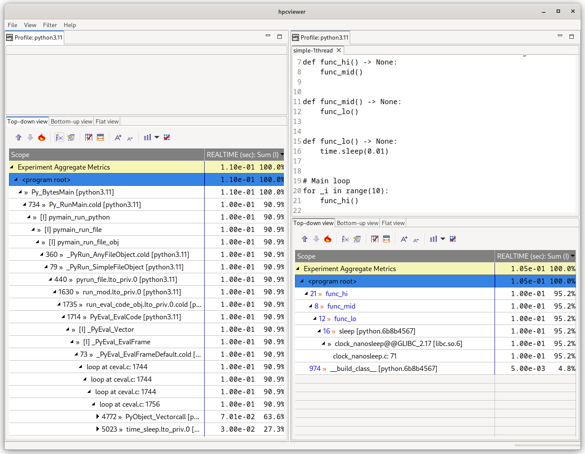

<!--
SPDX-FileCopyrightText: 2002-2023 Rice University
SPDX-FileCopyrightText: 2024 Contributors to the HPCToolkit Project

SPDX-License-Identifier: CC-BY-4.0
-->

# Monitoring Dynamically-linked Applications with `hpcrun`

This chapter describes the mechanics of using `hpcrun` and `hpclink`
to profile an application and collect performance data. For advice on
how to choose events, perform scaling studies, etc., see
Chapter [4](#chpt:effective-performance-analysis) *Effective
Strategies for Analyzing Program Performance*.

## Using `hpcrun`

The `hpcrun` launch script is used to run an application and collect
call path profiles and call path traces data for *dynamically linked* binaries. For
dynamically linked programs, this requires no change to the program
source and no change to the build procedure. You should build your
application natively with full optimization. `hpcrun` inserts its
profiling code into the application at runtime via `LD_PRELOAD`.

`hpcrun` monitors the execution of applications on a CPU using asynchronous sampling. If `hpcrun` is used without any arguments to measure a program

> ```
> hpcrun app arg ...
> ```

it will the measure the program's execution by sampling its CPUTIME and collect a call path profile for each thread in the execution. More about the CPUTIME metric can be found in Section [5.3.3](#linux-timers).

In addition to a call path profile, `hpcrun` can collect a call path trace of an execution if the `-t` (or `--trace`) option is used
turn on tracing. The following use of `hpcrun` will collect both a call path profile and a call path trace of CPU execution using the default CPUTIME sample source.

> ```
> hpcrun -t app arg ...
> ```

Traces are most useful for understanding the execution dynamics of multithreaded or multi-process applications; however, you may find a trace of a single-threaded application to be useful to understand how an execution unfolds over time.

While CPUTIME is used as the default sample source if no other sample source is specified, many other sample sources are available.
Typically, one uses the `-e` (or `--event`) to
specify a sample source and sampling rate.[^7]
Sample sources are specified as '`event@howoften`'
where `event` is the name of the source and `howoften` is either
a number specifying the period (threshold) for that event, or `f` followed by a number, e.g., `@f100`
specifying a target sampling frequency for the event in samples/second.[^8]
Note that a higher period implies a lower rate of sampling.
The `-e` option may be used multiple times to specify that multiple
sample sources be used for measuring an execution.

The basic syntax for profiling an application with
`hpcrun` is:

> ```
> hpcrun -t -e event@howoften ... app arg ...
> ```

For example, to profile an application using hardware counter sample sources
provided by Linux `perf_events` and sample cycles at 300 times/second (the default sampling frequency) and sample every 4,000,000 instructions,
you would use:

> ```
> hpcrun -e CYCLES -e INSTRUCTIONS@4000000 app arg ...
> ```

The units for timer-based sample sources (`CPUTIME` and `REALTIME` are microseconds,
so to sample an application with tracing every 5,000 microseconds
(200 times/second), you would use:

> ```
> hpcrun -t -e CPUTIME@5000 app arg ...
> ```

`hpcrun` stores its raw performance data in a *measurements*
directory with the program name in the directory name. On systems
with a batch job scheduler (eg, PBS) the name of the job is appended
to the directory name.

> ```
> hpctoolkit-app-measurements[-jobid]
> ```

It is best to use a different measurements directory for each run.
So, if you're using `hpcrun` on a local workstation without a job
launcher, you can use the '`-o dirname`' option to specify an
alternate directory name.

For programs that use their own launch script (eg, `mpirun` or
`mpiexec` for MPI), put the application's run script on the
outside (first) and `hpcrun` on the inside (second) on the command
line. For example,

> ```
> mpirun -n 4 hpcrun -e CYCLES mpiapp arg ...
> ```

Note that `hpcrun` is intended for profiling dynamically linked
*binaries*. It will not work well if used to profile a shell script.
At best, you would be profiling the shell interpreter, not the script
commands, and sometimes this will fail outright.

It is possible to use `hpcrun` to launch a statically linked binary,
but there are two problems with this. First, it is still necessary to
build the binary with `hpclink`. Second, static binaries are
commonly used on parallel clusters that require running the binary
directly and do not accept a launch script. However, if your system
allows it, and if the binary was produced with `hpclink`, then
`hpcrun` will set the correct environment variables for profiling
statically or dynamically linked binaries. All that `hpcrun` really
does is set some environment variables (including `LD_PRELOAD`)
and `exec` the binary.

### If `hpcrun` causes your application to fail

`hpcrun` can cause applications to fail in certain circumstances. Here, we describe two kind of failures that may arise and how to sidestep them.

(hpcrun-audit)=

#### `hpcrun` causes failures related to loading or using shared libraries

Unfortunately, the Glibc implementations used today on most platforms have known bugs monitoring loading and unloading of shared libraries and calls to a shared library's API.
While the best approach for coping with these problems is to use a system running Glibc 2.35 or later, for most people, this is not an option:
the system administrator picks the operating system version, which determines the Glibc version available to developers.

To understand what kinds of problems that you may encounter with shared libraries and how you can work around them, it is helpful to understand how HPCToolkit monitors shared libraries.
On Power and `x86_64` architectures, by default `hpcrun` uses `LD_AUDIT` to monitor an application's use of dynamic libraries.
Use of `LD_AUDIT` is the only strategy for monitoring shared libraries that will not cause a change in application behavior when libraries contain a `RUNPATH`. However, Glibc's implementation of `LD_AUDIT` has a number of bugs that may crash the application:

- Until Glibc 2.35, most applications running on ARM will crash. This was caused by a fatal flaw in Glibc's PLT handler for ARM, where an argument register that should have been saved was instead replaced with a junk pointer value. This register is used to return C/C++ `struct` values from functions and methods, including some C++ constructors.

- Until Glibc 2.35, applications and libraries using `dlmopen` will crash. While most applications do not use `dlmopen`, an example of a library that does is Intel's GTPin, which `hpcrun` uses to instrument Intel GPU code.

- Applications and libraries using significant amounts of static TLS space may crash with the message "`cannot allocate memory in static TLS block`."
  This is caused by a flaw in Glibc causing it to allocate insufficient static TLS space when `LD_AUDIT` is enabled.
  For Glibc 2.35 and newer, setting the environment variable

  ```
  export GLIBC_TUNABLES=glibc.rtld.optional_static_tls=0x1000000
  ```

  will instruct Glibc to allocate 16MB of static TLS memory per thread, in our experience this is far more than any application will use (however the value can be adjusted freely).
  For older Glibc, the only option is to disable `hpcrun`'s use of `LD_AUDIT`.

The following options direct `hpcrun` to adjust the strategy it uses for monitoring dynamic libraries. We suggest that you don't consider using any of these options unless your program fails using `hpcrun`'s defaults.

`--disable-auditor`
: This option instructs hpcrun
  to track dynamic library operations by intercepting
  `dlopen` and `dlclose` instead of using `LD_AUDIT`. Note
  that this alternate approach can cause problem with
  libraries and applications that specify a `RUNPATH`.

`--enable-auditor`
: This option is default, except on ARM or when Intel GTPin instrumentation is enabled.
  Passing this option instructs `hpcrun` to use `LD_AUDIT` in all cases.

`--disable-auditor-got-rewriting`
: When using an `LD_AUDIT`, Glibc unnecessarily intercepts
  every call to a function in a shared library. `hpcrun`
  avoids this overhead by rewriting each shared library's
  global offset table (GOT). Such rewriting is tricky.
  This option can be used to disable GOT rewriting if
  it is believed that the rewriting is causing the
  application to fail.

`--namespace-single`
: `dlmopen` may load a shared library into an alternate
  namespace, which crashes on Glibc until 2.35. This option instructs
  `hpcrun` to override `dlmopen` to instead load all
  shared libraries within the application namespace.
  This may significantly change application behavior, but may be helpful to avoid crashing.
  This option is default when Intel GTPin instrumentation is enabled.

`--namespace-multiple`
: This option is the opposite of `--namespace-single`, and will instruct `hpcrun` to *not* override `dlmopen` and thus retain its normal function.
  This option is default except when Intel GTPin instrumentation is enabled.

If your code fails to find libraries when it is monitoring your code by wrapping `dlopen` and `dlclose` rather than using `LD_AUDIT`, you can sidestep this problem by adding any library paths listed in the `RUNPATH` of your application or library to your `LD_LIBRARY_PATH` environment variable before launching `hpcrun`.

#### `hpcrun` causes your application to fail when `gprof` instrumentation is present

When an application has been compiled with the compiler flag `-pg`,
the compiler adds instrumentation to collect performance measurement data for
the `gprof` profiler. Measuring application performance with
HPCToolkit's measurement subsystem and `gprof` instrumentation
active in the same execution may cause the execution
to abort. One can detect the presence of `gprof` instrumentation in an
application by the presence of `__monstartup` and `_mcleanup` symbols
in a executable.
One can disable `gprof` instrumentation when measuring the performance of
a dynamically-linked application by using the `--disable-gprof`
argument to `hpcrun`.

## Hardware Counter Event Names

HPCToolkit uses libpfm4(Libpfm4 2008) to translate from an event name string to an event code recognized by the kernel.
An event name is case insensitive and is defined as followed:

```
[pmu::][event_name][:unit_mask][:modifier|:modifier=val]
```

- **pmu**. Optional name of the PMU (group of events) to which the event belongs to. This is useful to disambiguate events in case events from difference sources have the same name. If no pmu is specified, the first match event is used.

- **event_name**. The name of the event. It must be the complete name, partial matches are not accepted.

- **unit_mask**. Some events can be refined using sub-events. A `unit_mask` designates an optional sub-event. An event may have multiple unit masks and it is possible to combine them (for some events) by repeating `:unit_mask` pattern.

- **modifier**. A modifier is an optional filter that restricts when an event counts.
  The form of a modifier may be either `:modifier` or `:modifier=val`.
  For modifiers without a value, the presence of the modifier is
  interpreted as a restriction. Events may allow use of multiple modifiers
  at the same time.

  - **hardware event modifiers**. Some hardware events support one or more modifiers that restrict counting to a subset of events. For instance, on an Intel Broadwell EP, one can add a modifier to `MEM_LOAD_UOPS_RETIRED` to count only load operations that are
    an `L2_HIT` or an `L2_MISS`. For information about all modifiers for hardware events,
    one can direct HPCToolkit's measurement subsystem to list all native events and their modifiers
    as described in Section [5.3](#sample-sources).

  - **precise_ip**. For some events, it is possible to control the amount of skid.
    Skid is a measure of how many instructions may execute between an event and the PC where the event is reported.
    Smaller skid enables more accurate attribution of events to instructions. Without a skid modifier, hpcrun allows arbitrary skid because some architectures
    don't support anything more precise. One may optionally specify one of the following as a skid modifier:

    - `:p` : a sample must have constant skid.

    - `:pp` : a sample is requested to have 0 skid.

    - `:ppp` : a sample must have 0 skid.

    - `:P` : autodetect the least skid possible.

    NOTE: If the kernel or the hardware does not support the specified value of the skid, no error message will be reported
    but no samples will be recorded.

(sample-sources)=

## Sample Sources

This section provides an overview of how to use sample sources supported by HPCToolkit. To
see a list of the available sample sources and events that `hpcrun`
supports, use '`hpcrun -L`' (dynamic) or set
'`HPCRUN_EVENT_LIST=LIST`' (static). Note that on systems with
separate compute nodes, it is best to run this on a compute node.

### Linux `perf_events`

Linux `perf_events` provides a powerful interface that supports
measurement of both application execution and kernel activity.
Using
`perf_events`, one can measure both hardware and software events.
Using a processor's hardware performance monitoring unit (PMU), the
`perf_events` interface can measure an execution using any hardware counter
supported by the PMU. Examples of hardware events include cycles, instructions
completed, cache misses, and stall cycles. Using instrumentation built in to the Linux kernel,
the `perf_events` interface can measure software events. Examples of software events include page
faults, context switches, and CPU migrations.

#### Capabilities of HPCToolkit's `perf_events` Interface

##### Frequency-based sampling.

The Linux `perf_events` interface supports frequency-based sampling.
With frequency-based sampling, the kernel automatically selects and adjusts an event period with the
aim of delivering samples for that event at a target sampling frequency.[^9]
Unless a user explicitly specifies an event count threshold for an event,
HPCToolkit's measurement interface will use frequency-based sampling by default.
HPCToolkit's default sampling frequency is `min(300, M-1)`, where `M` is the
value specified in the system configuration file `/proc/sys/kernel/perf_event_max_sample_rate`.

For circumstances where the user wants to use frequency-based sampling but
HPCToolkit's default sampling frequency is inappropriate,
one can specify the target sampling frequency for a particular event using the notation
*event*`@f`*rate* when specifying an event or change the default sampling frequency.
When measuring a dynamically-linked executable using `hpcrun`, one can change the default sampling frequency using `hpcrun`'s `-c` option. To set a new default sampling frequency for a statically-linked executable instrumented with `hpclink`, set the `HPCRUN_PERF_COUNT` environment variable.
The section below entitled *Launching* provides
examples of how to monitor an execution using frequency-based sampling.

##### Multiplexing.

Using multiplexing enables one to monitor more events
in a single execution than the number of hardware counters a processor
can support for each thread. The number of events that can be monitored in
a single execution is only limited by the maximum number of concurrent
events that the kernel will allow a user to multiplex using the
`perf_events` interface.

When more events are specified than can be monitored simultaneously
using a thread's hardware counters,[^10] the kernel will employ multiplexing and divide
the set of events to be monitored into groups, monitor only one group
of events at a time, and cycle repeatedly through the groups
as a program executes.

For applications that have very regular,
steady state behavior, e.g., an iterative code with lots of
iterations, multiplexing will yield results that are suitably representative
of execution behavior. However, for executions that consist of
unique short phases, measurements collected using multiplexing may
not accurately represent the execution behavior. To obtain
more accurate measurements, one can run an application multiple times and in
each run collect a subset of events that can be measured without multiplexing.
Results from several such executions can be imported into HPCToolkit's `hpcviewer`
and analyzed together.

##### Thread blocking.

When a program executes,
a thread may block waiting for the kernel to complete some operation on its behalf.
For instance, a thread may block waiting for data to become available so that a `read` operation
can complete. On systems running Linux 4.3 or newer, one can use the `perf_events` sample source to monitor how much time a thread is blocked and where the blocking occurs. To measure
the time a thread spends blocked, one can profile with `BLOCKTIME` event and
another time-based event, such as `CYCLES`. The `BLOCKTIME` event shouldn't have any frequency or period specified, whereas `CYCLES` may have a frequency or period specified.

#### Launching

When sampling with native events, by default hpcrun will profile using `perf_events`.
To force HPCToolkit to use PAPI rather than `perf_events` to oversee monitoring of a PMU event
(assuming that HPCToolkit has been configured to include support for PAPI),
one must prefix the event with '`papi::`' as follows:

> ```
> hpcrun -e papi::CYCLES
> ```

For PAPI presets, there is no need to prefix the event with
'`papi::`'. For instance it is sufficient to specify `PAPI_TOT_CYC` event
without any prefix to profile using PAPI. For more information about using PAPI, see Section [5.3.2](#section:papi).

Below, we provide some examples of various ways to measure `CYCLES`
and `INSTRUCTIONS` using HPCToolkit's `perf_events` measurement substrate:

To sample an execution 100 times per second (frequency-based sampling) counting `CYCLES`
and 100 times a second counting `INSTRUCTIONS`:

> ```
> hpcrun -e CYCLES@f100 -e INSTRUCTIONS@f100 ...
> ```

To sample an execution every 1,000,000 cycles and every 1,000,000 instructions using period-based sampling:

> ```
> hpcrun -e CYCLES@1000000 -e INSTRUCTIONS@1000000
> ```

By default, hpcrun uses frequency-based sampling with the rate
300 samples per second per event type. Hence the following command causes HPCToolkit to
sample `CYCLES` at 300 samples per second and `INSTRUCTIONS` at 300 samples per second:

> ```
> hpcrun -e CYCLES -e INSTRUCTIONS ...
> ```

One can specify a different default sampling period or frequency using the `-c` option.
The command below will sample `CYCLES` and `INSTRUCTIONS` at 200 samples per second each:

> ```
> hpcrun -c f200 -e CYCLES -e INSTRUCTIONS ...
> ```

#### Notes

- Linux `perf_events` uses one file descriptor for each event to be monitored.
  Furthermore, since `hpcrun` generates one hpcrun file for each thread, and an additional hpctrace file if traces is enabled.
  Hence for `e` events and `t` threads, the required number of file descriptors is:

  > `t * e + t` (`+t` if trace is enabled)

  For instance, if one profiles a multi-threaded program that executes with 500 threads using 4 events,
  then the required number of file descriptors is

  > 500 threads * 4 events + 500 hpcrun files + 500 hpctrace files\
  > = 3000 file descriptors

  If the number of file descriptors exceeds the number of maximum number of open files, then the program will crash.
  To remedy this issue, one needs to increase the number of maximum number of open files allowed.

- When a system is configured with suitable permissions, HPCToolkit will sample call stacks
  within the Linux kernel in addition to application-level call stacks. This feature can be useful to measure kernel activity on behalf of a thread (e.g., zero-filling allocated pages when they are first touched)
  or to observe where, why, and how long a thread blocks.
  For a user to be able to sample kernel call stacks, the configuration file
  `/proc/sys/kernel/perf_event_paranoid` must have a value \<=1. To associate addresses
  in kernel call paths with function names, the value of
  `/proc/sys/kernel/kptr_restrict` must be 0 (number zero). If these settings are not configured in this way on your system, you will need someone with administrator privileges to change them for you to
  be able to sample call stacks within the kernel.

- Due to a limitation present in all Linux kernel versions currently available,
  HPCToolkit's measurement subsystem can only approximate a thread's blocking time.
  At present, Linux reports when a thread blocks but does not report when a thread resumes execution.
  For that reason, HPCToolkit's measurement subsystem approximates the time a thread spends blocked using sampling as the time between when the thread blocks and when the thread receives its first sample
  after resuming execution.

- Users need to be cautious when considering measured counts of events that have been collected using
  hardware counter multiplexing. Currently, it is not obvious to a user
  if a metric was measured using a multiplexed counter. This information is
  present in the measurements but is not currently visible in `hpcviewer`.

(section:papi)=

### PAPI

PAPI, the Performance API, is a library for providing access to the
hardware performance counters. PAPI aims to provide a
consistent, high-level interface that consists of a universal set of event names that can be used
to measure performance on any processor, independent of any processor-specific event names.
In some cases, PAPI event names
represent quantities synthesized by combining measurements based on multiple native events
available on a particular processor.
For instance, in some cases PAPI reports
total cache misses by measuring and combining data misses and instruction misses.
PAPI is available from the University of Tennessee at <http://icl.cs.utk.edu/papi>.

PAPI focuses mostly on in-core CPU events: cycles, cache misses,
floating point operations, mispredicted branches, etc. For example,
the following command samples total cycles and L2 cache misses.

> ```
> hpcrun -e PAPI_TOT_CYC@15000000 -e PAPI_L2_TCM@400000 app arg ...
> ```

The precise set of PAPI preset and native events is highly system
dependent. Commonly, there are events for machine cycles, cache
misses, floating point operations and other more system specific
events. However, there are restrictions both on how many events can
be sampled at one time and on what events may be sampled together and
both restrictions are system dependent. Table [5.1](#tab:papi-events)
contains a list of commonly available PAPI events.

To see what PAPI events are available on your system, use the
`papi_avail` command from the `bin` directory in your PAPI
installation. The event must be both available and not derived to be
usable for sampling. The command `papi_native_avail` displays
the machine's native events. Note that on systems with separate
compute nodes, you normally need to run `papi_avail` on one of
the compute nodes.

```{table} Some commonly available PAPI events. The exact set of available events is system dependent.
---
name: tab:papi-events
---
| Name | Description|
| :------------- | :------------------------------------------- |
| `PAPI_BR_INS`  | Branch instructions                          |
| `PAPI_BR_MSP`  | Conditional branch instructions mispredicted |
| `PAPI_FP_INS`  | Floating point instructions                  |
| `PAPI_FP_OPS`  | Floating point operations                    |
| `PAPI_L1_DCA`  | Level 1 data cache accesses                  |
| `PAPI_L1_DCM`  | Level 1 data cache misses                    |
| `PAPI_L1_ICH`  | Level 1 instruction cache hits               |
| `PAPI_L1_ICM`  | Level 1 instruction cache misses             |
| `PAPI_L2_DCA`  | Level 2 data cache accesses                  |
| `PAPI_L2_ICM`  | Level 2 instruction cache misses             |
| `PAPI_L2_TCM`  | Level 2 cache misses                         |
| `PAPI_LD_INS`  | Load instructions                            |
| `PAPI_SR_INS`  | Store instructions                           |
| `PAPI_TLB_DM`  | Data translation lookaside buffer misses     |
| `PAPI_TOT_CYC` | Total cycles                                 |
| `PAPI_TOT_IIS` | Instructions issued                          |
| `PAPI_TOT_INS` | Instructions completed                       |
```

When selecting the period for PAPI events, aim for a rate of
approximately a few hundred samples per second. So, roughly several
million or tens of million for total cycles or a few hundred thousand
for cache misses. PAPI and `hpcrun` will tolerate sampling rates as
high as 1,000 or even 10,000 samples per second (or more). However, rates
higher than a few hundred samples per second will only increase measurement
overhead and distort the execution of your program; they won't yield more
accurate results.

Beginning with Linux kernel version 2.6.32,
support for accessing performance counters
using the Linux `perf_events` performance monitoring subsystem is
built into the kernel. `perf_events` provides a measurement substrate for PAPI on Linux.

On modern Linux systems that include support
for `perf_events`, PAPI is only recommended for monitoring
events outside the scope of the `perf_events` interface.

#### Proxy Sampling

HPCToolkit supports proxy sampling for derived PAPI events.
For HPCToolkit to sample a PAPI event directly, the event must not be
derived and must trigger hardware interrupts when a threshold is exceeded.
For events that cannot trigger interrupts directly, HPCToolkit's proxy sampling
sample on another event that is supported directly and then reads the
counter for the derived event. In this case,
a native event can serve as a proxy for one or more derived events.

To use proxy sampling, specify the `hpcrun` command line as usual and
be sure to include at least one non-derived PAPI event. The derived
events will be accumulated automatically when processing a sample trigger for a native event.
We recommend adding `PAPI_TOT_CYC` as a native event when using proxy sampling, but
proxy sampling will gather data as long as the event set contains at least one
non-derived PAPI event. Proxy sampling requires one non-derived PAPI event to serve as the proxy;
a Linux timer can't serve as the proxy for a PAPI derived event.

For example, on newer Intel CPUs, often PAPI floating point events are
all derived and cannot be sampled directly. In that case, you could
count FLOPs by using cycles a proxy event with a command line such as
the following. The period for derived events is ignored and may be
omitted.

> ```
> hpcrun -e PAPI_TOT_CYC@6000000 -e PAPI_FP_OPS app arg ...
> ```

Attribution of proxy samples is not as accurate as regular samples.
The problem, of course, is that the event that triggered the sample
may not be related to the derived counter. The total count of events
should be accurate, but their location at the leaves in the Calling
Context tree may not be very accurate. However, the higher up the
CCT, the more accurate the attribution becomes. For example, suppose
you profile a loop of mixed integer and floating point operations and
sample on `PAPI_TOT_CYC` directly and count `PAPI_FP_OPS`
via proxy sampling. The attribution of flops to individual statements
within the loop is likely to be off. But as long as the loop is long
enough, the count for the loop as a whole (and up the tree) should be
accurate.

(linux-timers)=

### REALTIME and CPUTIME

HPCToolkit supports two timer-based sample sources: `CPUTIME` and
`REALTIME`.
The unit for periods of these timers is microseconds.

Before describing this capability further, it is worth noting
that the CYCLES event supported by Linux `perf_events` or PAPI's `PAPI_TOT_CYC`
are generally superior to any of the timer-based sampling sources.

The `CPUTIME` and `REALTIME` sample sources are based on the POSIX
timers `CLOCK_THREAD_CPUTIME_ID` and `CLOCK_REALTIME` with
the Linux `SIGEV_THREAD_ID` extension.
`CPUTIME` only counts time when the CPU is running;
`REALTIME` counts
real (wall clock) time, whether the process is running or not.
Signal delivery for these timers is thread-specific, so these timers are suitable for
profiling multithreaded programs.
Sampling using the `REALTIME` sample source
may break some applications that don't handle interrupted syscalls well. In that
case, consider using `CPUTIME` instead.

The following example, which specifies a period of 5000 microseconds will sample
each thread in `app` at a rate of approximately 200 times per second.

> ```
> hpcrun -e REALTIME@5000 app arg ...
> ```

do not use more than one timer-based sample source to monitor a program execution.
When using a sample source such as `CPUTIME` or `REALTIME`,
we recommend not using another time-based sampling source such as
Linux `perf_events` CYCLES or PAPI's `PAPI_TOT_CYC`.
Technically, this is feasible and `hpcrun` won't die.
However, multiple time-based sample sources would compete with one another to measure the
execution and likely lead to dropped samples and possibly distorted results.

### IO

The `IO` sample source counts the number of bytes read and
written. This displays two metrics in the viewer: "IO Bytes Read"
and "IO Bytes Written." The `IO` source is a synchronous sample
source.
It overrides the functions `read`, `write`, `fread`
and `fwrite` and records the number of bytes read or
written along with their dynamic context synchronously rather
than relying on data collection triggered by interrupts.

To include this source, use the `IO` event (no period). In the
static case, two steps are needed. Use the `--io` option for
`hpclink` to link in the `IO` library and use the `IO` event
to activate the `IO` source at runtime. For example,

> |           |                                                    |
> | :-------: | :------------------------------------------------- |
> | (dynamic) | `hpcrun -e IO app arg ...`                         |
> | (static)  | `hpclink --io gcc -g -O -static -o app file.c ...` |
> |           | `export HPCRUN_EVENT_LIST=IO`                      |
> |           | `app arg ...`                                      |

The `IO` source is mainly used to find where your program reads or
writes large amounts of data. However, it is also useful for tracing
a program that spends much time in `read` and `write`. The
hardware performance counters do not advance while running in
the kernel, so the trace viewer may misrepresent the amount of time
spent in syscalls such as `read` and `write`. By adding the
`IO` source, `hpcrun` overrides `read` and `write` and
thus is able to more accurately count the time spent in these
functions.

### MEMLEAK

The `MEMLEAK` sample source counts the number of bytes allocated
and freed. Like `IO`, `MEMLEAK` is a synchronous sample
source and does not generate asynchronous interrupts. Instead, it
overrides the malloc family of functions (`malloc`, `calloc`,
`realloc` and `free` plus `memalign`, `posix_memalign`
and `valloc`) and records the number of bytes
allocated and freed along with their dynamic context.

`MEMLEAK` allows you to find locations in your program that
allocate memory that is never freed. But note that failure to free a
memory location does not necessarily imply that location has leaked
(missing a pointer to the memory). It is common for programs to
allocate memory that is used throughout the lifetime of the process
and not explicitly free it.

To include this source, use the `MEMLEAK` event (no period).
Again, two steps are needed in the static case. Use the `--memleak`
option for `hpclink` to link in the `MEMLEAK` library
and use the `MEMLEAK` event to activate it at runtime. For
example,

> |           |                                                         |
> | :-------: | :------------------------------------------------------ |
> | (dynamic) | `hpcrun -e MEMLEAK app arg ...`                         |
> | (static)  | `hpclink --memleak gcc -g -O -static -o app file.c ...` |
> |           | `export HPCRUN_EVENT_LIST=MEMLEAK`                      |
> |           | `app arg ...`                                           |

If a program allocates and frees many small regions, the `MEMLEAK`
source may result in a high overhead. In this case, you may reduce
the overhead by using the memleak probability option to record only a
fraction of the mallocs. For example, to monitor 10% of the mallocs,
use:

> |           |                                                     |
> | :-------: | :-------------------------------------------------- |
> | (dynamic) | `hpcrun -e MEMLEAK --memleak-prob 0.10 app arg ...` |
> | (static)  | `export HPCRUN_EVENT_LIST=MEMLEAK`                  |
> |           | `export HPCRUN_MEMLEAK_PROB=0.10`                   |
> |           | `app arg ...`                                       |

It might appear that if you monitor only 10% of the program's
mallocs, then you would have only a 10% chance of finding the leak.
But if a program leaks memory, then it's likely that it does so many
times, all from the same source location. And you only have to find
that location once. So, this option can be a useful tool if the
overhead of recording all mallocs is prohibitive.

Rarely, for some programs with complicated memory usage patterns, the
`MEMLEAK` source can interfere with the application's memory
allocation causing the program to segfault. If this happens, use the
`hpcrun` debug (`dd`) variable `MEMLEAK_NO_HEADER` as a
workaround.

> |           |                                                       |
> | :-------: | :---------------------------------------------------- |
> | (dynamic) | `hpcrun -e MEMLEAK -dd MEMLEAK_NO_HEADER app arg ...` |
> | (static)  | `export HPCRUN_EVENT_LIST=MEMLEAK`                    |
> |           | `export HPCRUN_DEBUG_FLAGS=MEMLEAK_NO_HEADER`         |
> |           | `app arg ...`                                         |

The `MEMLEAK` source works by attaching a header or a footer to
the application's `malloc`'d regions. Headers are faster but
have a greater potential for interfering with an application. Footers
have higher overhead (require an external lookup) but have almost no
chance of interfering with an application. The
`MEMLEAK_NO_HEADER` variable disables headers and uses only
footers.

## Experimental Python Support

This section provides a brief overview of how to use HPCToolkit to analyze the performance of Python-based applications.
Normally, `hpcrun` will attribute performance to the CPython implementation, not to the application Python code, as shown in Figure [5.1](#fig:python-support).
This usually is of little interest to an application developer, so HPCToolkit provides experimental support for attributing to Python callstacks.

**NOTE: Python support in HPCToolkit is in early days. If you compile HPCToolkit to match the version of Python being used by your application, in many cases you will find that you can measure what you want. However, other cases may not work as expected; crashes and corrupted performance data are not uncommon. For the aforementioned reasons, use at your own risk.**

```{figure-md} fig:python-support



Example of a simple Python application measured without (left) and with (right) Python support enabled via `hpcrun` `-a python`.
The left database has no source code, since sources were not provided for the CPython implementation.
```

If HPCToolkit has been compiled with Python support enabled, `hpcrun` is able to replace segments of the C callstacks with the Python code running in those frames.
To enable this transformation, profile your application the additional `-a python` flag:

> |           |                                                          |
> | :-------: | :------------------------------------------------------- |
> | (dynamic) | `hpcrun -a python -e event@howoften python3 app arg ...` |

As shown in Figure [5.1](#fig:python-support), passing this flag removes the CPython implementation details, replacing it with the much smaller Python callstack.
When Python calls an external C library, HPCToolkit will report both the name of the Python function object and the C function being called, in this example `sleep` and Glibc's `clock_nanosleep` respectively.

### Known Limitations

This section lists a number of known limitations with the current implementation of the Python support.
It is recommended that users are aware of these limitations before attempting to use the Python support in practice.

1. Pythons older than 3.8 are not supported by HPCToolkit.
   Please upgrade any applications and Python extensions to use a recent version of Python before attempting to enable Python support.

1. The application should be run with the same Python that was used to compile HPCToolkit.
   The CPython ABI can change between patch versions and due to certain build configuration flags.
   To ensure `hpcrun` will not unwittingly crash the application, it is best to use a single Python for both HPCToolkit and the application.

   Despite this recommendation, it is worth noting that we have had some minor success with cross-version compatibility (e.g. building HPCToolkit with Python 3.11.8 support and using it to measure a program running under Python 3.11.6) However, you should be surprised if cross-version compatibility works rather than expecting it to work, even across patch releases.

1. The bottom-up and flat views of `hpcviewer` may not correctly present Python callstacks, particularly those that call C/C++ extensions.
   Some Python functions may be missing, and the metrics attributed to them may be suspect.
   In these cases, refer to the top-down view as the known-good source of truth.

1. Threads spawned by Python's `threading` and `subprocess` modules are not fully supported.
   Only the main Python thread will attribute performance to Python callstacks, all others will attribute performance to the CPython implementation.
   If Python `threading` is a performance bottleneck, consider implementing the parallelism in a C/C++ extension instead of in Python to avoid [contention on the GIL](https://docs.python.org/3/glossary.html#term-global-interpreter-lock).

1. Applications using signals and signal handlers, for example Python's `signal` module, will experience crashes when run under `hpcrun`.
   The current implementation fails to process the non-sequential modifications to the Python stack that take place when Python handles signals.

## Process Fraction

Although `hpcrun` can profile parallel jobs with thousands or tens of
thousands of processes, there are two scaling problems that become
prohibitive beyond a few thousand cores. First, `hpcrun` writes the
measurement data for all of the processes into a single directory.
This results in one file per process plus one file per thread (two
files per thread if using tracing). Unix file systems are not
equipped to handle directories with many tens or hundreds of thousands
of files. Second, the sheer volume of data can overwhelm the viewer
when the size of the database far exceeds the amount of memory on the
machine.

The solution is to sample only a fraction of the processes. That is,
you can run an application on many thousands of cores but record data
for only a few hundred processes. The other processes run the
application but do not record any measurement data. This is what the
process fraction option (`-f` or `--process-fraction`) does.
For example, to monitor 10% of the processes, use:

> |           |                                                |
> | :-------: | :--------------------------------------------- |
> | (dynamic) | `hpcrun -f 0.10 -e event@howoften app arg ...` |
> | (dynamic) | `hpcrun -f 1/10 -e event@howoften app arg ...` |
> | (static)  | `export HPCRUN_EVENT_LIST='event@howoften'`    |
> |           | `export HPCRUN_PROCESS_FRACTION=0.10`          |
> |           | `app arg ...`                                  |

With this option, each process generates a random number and records
its measurement data with the given probability. The process fraction
(probability) may be written as a decimal number (0.10) or as a
fraction (1/10) between 0 and 1. So, in the above example, all three
cases would record data for approximately 10% of the processes. Aim
for a number of processes in the hundreds.

## Starting and Stopping Sampling

HPCToolkit supports an API for the application to start and stop
sampling. This is useful if you want to profile only a subset of a
program and ignore the rest. The API supports the following
functions.

> ```
> void hpctoolkit_sampling_start(void);
> void hpctoolkit_sampling_stop(void);
> ```

For example, suppose that your program has three major phases: it
reads input from a file, performs some numerical computation on the
data and then writes the output to another file. And suppose that you
want to profile only the compute phase and skip the read and write
phases. In that case, you could stop sampling at the beginning of the
program, restart it before the compute phase and stop it again at the
end of the compute phase.

This interface is process wide, not thread specific. That is, it
affects all threads of a process. Note that when you turn sampling on
or off, you should do so uniformly across all processes, normally at
the same point in the program. Enabling sampling in only a subset of
the processes would likely produce skewed and misleading results.

And for technical reasons, when sampling is turned off in a threaded
process, interrupts are disabled only for the current thread. Other
threads continue to receive interrupts, but they don't unwind the call
stack or record samples. So, another use for this interface is to
protect syscalls that are sensitive to being interrupted with signals.
For example, some Gemini interconnect (GNI) functions called from
inside `gasnet_init()` or `MPI_Init()` on Cray XE systems
will fail if they are interrupted by a signal. As a workaround, you
could turn sampling off around those functions.

Also, you should use this interface only at the top level for major
phases of your program. That is, the granularity of turning sampling
on and off should be much larger than the time between samples.
Turning sampling on and off down inside an inner loop will likely
produce skewed and misleading results.

To use this interface, put the above function calls into your program
where you want sampling to start and stop. Remember, starting and
stopping apply process wide. For C/C++, include the following header
file from the HPCToolkit `include` directory.

> ```
> #include <hpctoolkit.h>
> ```

Compile your application with `libhpctoolkit` with `-I` and
`-L` options for the include and library paths. For example,

> ```
> gcc -I /path/to/hpctoolkit/include app.c ... \
>     -L /path/to/hpctoolkit/lib/hpctoolkit -lhpctoolkit ...
> ```

The `libhpctoolkit` library provides weak symbol no-op definitions
for the start and stop functions. For dynamically linked programs, be
sure to include `-lhpctoolkit` on the link line (otherwise your
program won't link). For statically linked programs, `hpclink` adds
strong symbol definitions for these functions. So, `-lhpctoolkit`
is not necessary in the static case, but it doesn't hurt.

To run the program, set the `LD_LIBRARY_PATH` environment
variable to include the HPCToolkit `lib/hpctoolkit` directory.
This step is only needed for dynamically linked programs.

> ```
> export LD_LIBRARY_PATH=/path/to/hpctoolkit/lib/hpctoolkit
> ```

Note that sampling is initially turned on until the program turns it
off. If you want it initially turned off, then use the `-ds` (or
`--delay-sampling`) option for `hpcrun` (dynamic) or set the
`HPCRUN_DELAY_SAMPLING` environment variable (static).

> |           |                                             |
> | :-------: | :------------------------------------------ |
> | (dynamic) | `hpcrun -ds -e event@howoften app arg ...`  |
> | (static)  | `export HPCRUN_EVENT_LIST='event@howoften'` |
> |           | `export HPCRUN_DELAY_SAMPLING=1`            |
> |           | `app arg ...`                               |

(sec:env-vars)=

## Environment Variables for `hpcrun`

For most systems, `hpcrun` requires no special environment variable settings.
There are two situations, however, where `hpcrun`, to function correctly,
*must* refer to environment variables. These environment variables, and
corresponding situations are:

`HPCTOOLKIT`
: To function correctly, `hpcrun` must know
  the location of the HPCToolkit top-level installation directory.
  The `hpcrun` script uses elements of the installation `lib` and
  `libexec` subdirectories. On most systems, the
  `hpcrun` can find the requisite
  components relative to its own location in the file system.
  However, some parallel job launchers *copy* the
  `hpcrun` script to a different location as they launch a job. If your
  system does this, you must set the `HPCTOOLKIT`
  environment variable to the location of the HPCToolkit top-level installation directory
  before launching a job.

**Note to system administrators:** if your system provides a module system for configuring
software packages, then constructing
a module for HPCToolkit to initialize these environment variables to appropriate settings
would be convenient for users.

(sec:platform-specific)=

## Cray System Specific Notes

If you are trying to profile a dynamically-linked executable on a Cray that is still using the ALPS job launcher and you see an error like the following

> ```
> /var/spool/alps/103526/hpcrun: Unable to find HPCTOOLKIT root directory.
> Please set HPCTOOLKIT to the install prefix, either in this script,
> or in your environment, and try again.
> ```

in your job's error log then read on. Otherwise, skip this section.

The problem is that the Cray job launcher copies HPCToolkit's `hpcrun`
script to a directory somewhere below `/var/spool/alps/` and runs
it from there. By moving `hpcrun` to a different directory, this
breaks `hpcrun`'s method for finding HPCToolkit's install directory.

To fix this problem, in your job script, set `HPCTOOLKIT` to the top-level HPCToolkit installation directory
(the directory containing the `bin`, `lib` and
`libexec` subdirectories) and export it to the environment.
(If launching statically-linked binaries created using `hpclink`, this step is unnecessary, but harmless.)
Figure [5.2](#cray-alps) show a skeletal job script that sets the `HPCTOOLKIT` environment variable before monitoring
a dynamically-linked executable with `hpcrun`:

````{note}
---
name: cray-alps
---
> ```
> #!/bin/sh
> #PBS -l mppwidth=#nodes
> #PBS -l walltime=00:30:00
> #PBS -V
>
> export HPCTOOLKIT=/path/to/hpctoolkit/install/directory
> export CRAY_ROOTFS=DSL
>
> cd \$PBS_O_WORKDIR
> aprun -n #nodes hpcrun -e event@howoften dynamic-app arg ...</code></pre>
> ```

A sketch of how to help HPCToolkit find its dynamic libraries when using Cray's ALPS job launcher.
````

Your system may have a module installed for `hpctoolkit` with the
correct settings for `PATH`, `HPCTOOLKIT`, etc. In that case,
the easiest solution is to load the `hpctoolkit` module. Try
"`module show hpctoolkit`" to see if it sets `HPCTOOLKIT`.

[^7]: GPU and OpenMP measurement events don't accept a rate.

[^8]: Frequency-based sampling and
    the frequency-based notation for `howoften` is only
    available for sample sources managed by Linux `perf_events`. For Linux `perf_events`, HPCToolkit uses
    a default sampling frequency of 300 samples/second.

[^9]: The
    kernel may be unable to deliver the desired frequency if
    there are fewer events per second than the desired frequency.

[^10]: How many events can be
    monitored simultaneously on a particular processor may depend on the
    events specified.
