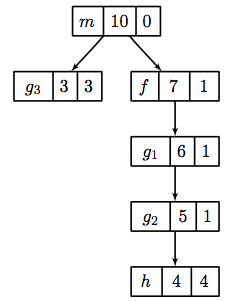
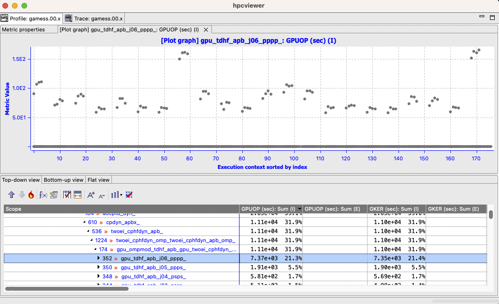
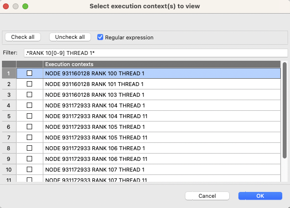
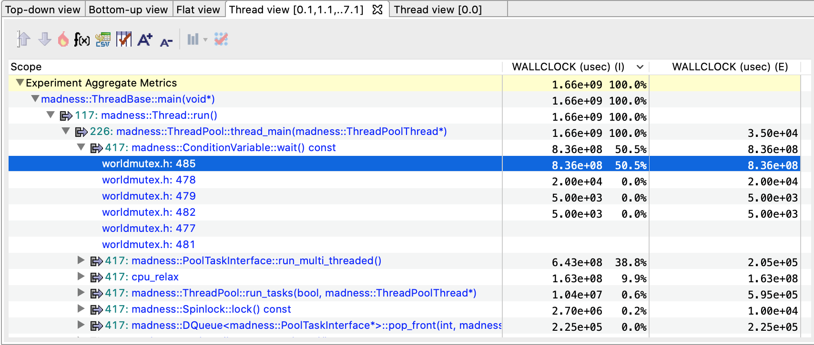
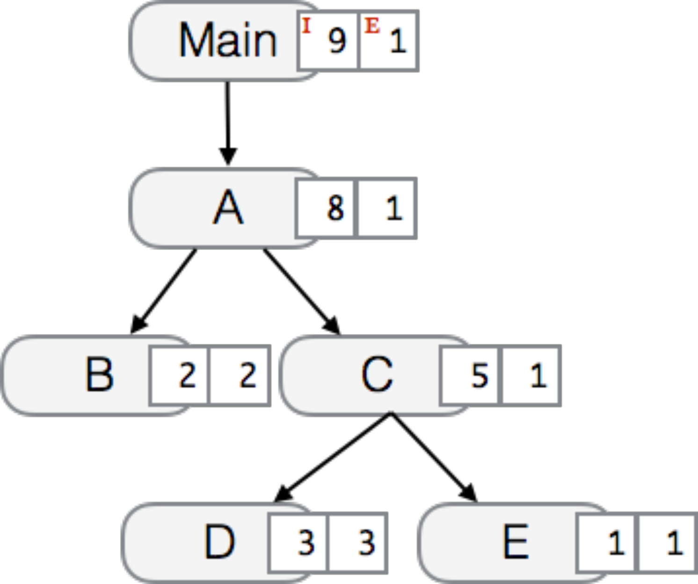
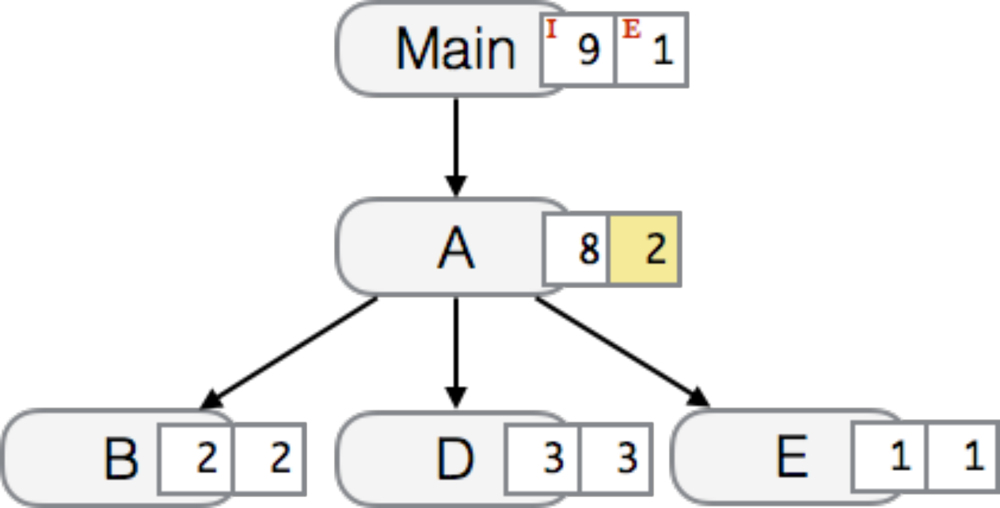
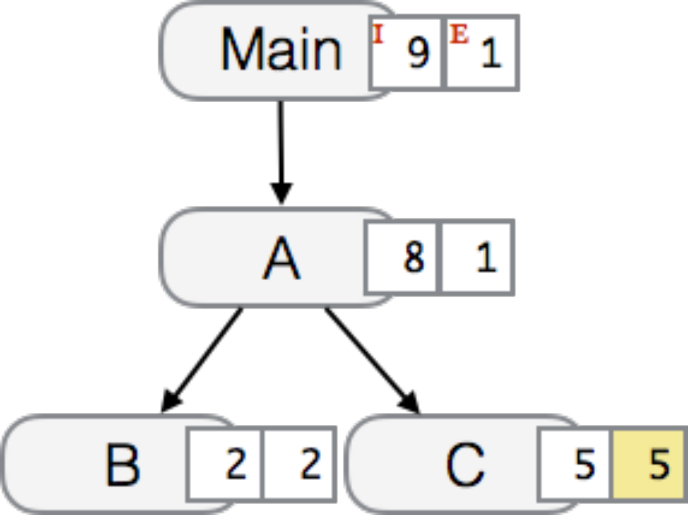
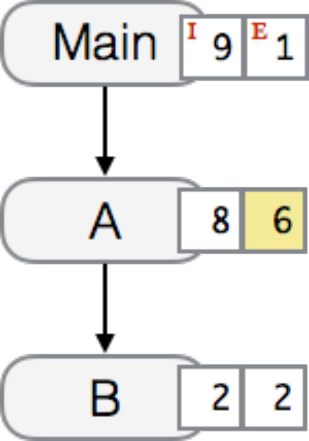
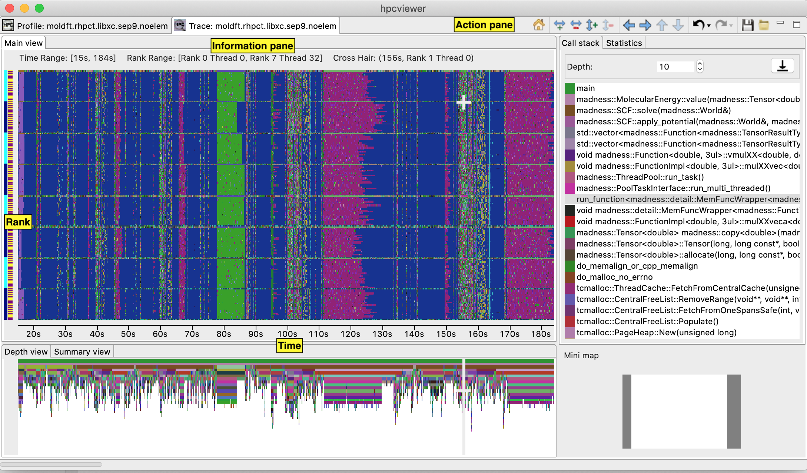
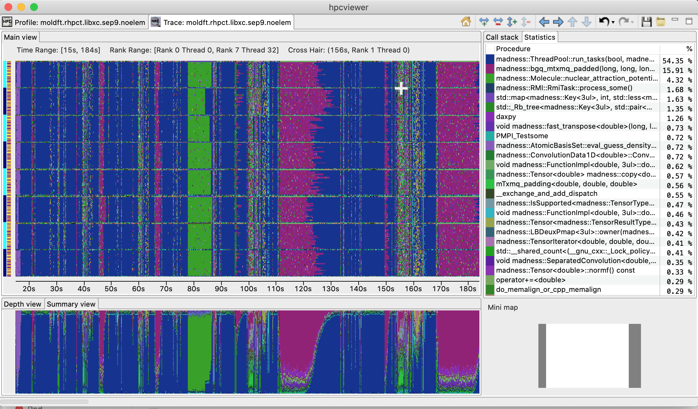

<!--
SPDX-FileCopyrightText: 2002-2023 Rice University
SPDX-FileCopyrightText: 2024 Contributors to the HPCToolkit Project

SPDX-License-Identifier: CC-BY-4.0
-->

# Analyzing Performance Data with `hpcviewer`

HPCToolkit provides the `hpcviewer` (Adhianto, Mellor-Crummey, and Tallent 2010; N. R. Tallent et al. 2011) performance presentation tool for interactive examination of performance databases.
`hpcviewer` presents a heterogeneous
calling context tree that spans both CPU and GPU contexts, annotated
with measured or derived metrics to help users assess code performance
and identify bottlenecks.

The database generated by `hpcprof` consists of 4 dimensions: *execution context* (also called *execution profile*), *time*, *tree node context*, and *metric*.
We employ the term *execution context* to include any logical threads (such as OpenMP, pthread and C++ threads), and also MPI processes and GPU streams.
The *time* dimension represents the timeline of the program's execution, and *tree node context* depicts a top-down path in a calling-context tree.
This time dimension is only available if the application is profiled with traces enabled (`hpcrun` `-t` option).
Finally, the *metric* dimension constitutes program measurements performed by *hpcrun* such as cycles, number of instructions, stall percentages and also some derived metrics such as ratio of idleness.

To simplify performance data visualization, `hpcviewer` restricts
display two dimensions at a time: the *Profile view* (Section [10.2](#sec:profile)) displays
pairs of (tree node context, metric) or (execution context,
metric) dimensions; and the *Trace viewer* (Section [10.9](#sec:trace)) visualizes the
behavior of execution contexts over time.
Table below summarizes views supported by hpcviewer.

| View                  | Dimension                    | Note                                                                |
| :-------------------- | :--------------------------- | :------------------------------------------------------------------ |
| Profile view - Table  | Tree node context x Metrics  | display the tree and its associated metrics                         |
| Profile view - Thread | Tree node context x Metrics  | display the tree and its metrics for a set of execution contexts    |
| Profile view - Graph  | Execution contexts x Metrics | display a metric of a specific tree node for all execution contexts |
| Trace view - Main     | Execution contexts x Time    | display execution context behavior over time                        |
| Trace view - Depth    | Tree node context x Time     | display call stacks over time of an execution context               |

Note that in the Profile view, GPU stream execution contexts are not shown in this view; metrics for a GPU operation are associated with the calling context in the thread that initiated the GPU operation (Section [10.6](#sec:hpcviewer:thread-level)).
In the Trace view, GPU streams have their own trace lines independently from their host so that it allows to separate traces between hosts and devices.

## Launching

Requirements to launch `hpcviewer`:

- On all platforms: Java 11 or newer (up to Java 17).

- On Linux: GTK 3.20 or newer.

`hpcviewer` can either be launched from a command line (Linux platforms) or by clicking the `hpcviewer` icon (for Windows, Mac OS X and Linux platforms).
The command line syntax is as follows:

> ```
> hpcviewer [options] [<hpctoolkit-database>]
> ```

Here, `<hpctoolkit-database>` is an optional argument to load a database automatically.
Without this argument, `hpcviewer` will prompt for the location of a database. Possible options for `hpcviewer` are shown below:

`-h, --help`
: Print a help message.

`-jh, --java-heap` *size*
: Set the JVM maximum heap size for this execution of `hpcviewer`. The value of *size* must be in megabytes (M) or gigabytes (G). For example, one can specify a *size* of 3 gigabytes as either 3076M or 3G.

`-v, --version`
: Print the current version

On Linux, when `hpcviewer` is installed using its `install.sh` script, which chooses a default maximum size for the Java heap on the current platform. When analyzing measurements for large and complex applications, it may be necessary to use the `--java-heap` option to specify a larger heap size for `hpcviewer` to accommodate many metrics for many contexts.

On MacOs and Windows the value of JVM maximum heap size is stored in `hpcviewer.ini` file, specified with `-Xmx` option.
On MacOS, this file is located at `hpcviewer.app/Contents/Eclipse/hpcviewer.ini`.

(sec:profile)=

## Profile View

```{figure-md} fig:hpcviewer-legend


An annotated screenshot of `hpcviewer`'s interface.
```

This view is the default view and displays pairs of \<context, metric> dimensions.
It interactively presents context-sensitive performance metrics correlated to program structure and mapped to a program's source code, if available.
It can present an arbitrary collection of performance metrics gathered during one or more runs or compute derived metrics.

Figure [10.1](#fig:hpcviewer-legend) shows an annotated screenshot of `hpcviewer`'s user interface presenting a call path profile.
The annotations highlight `hpcviewer`'s principal window panes and key controls.
The browser window is divided into three panes.
The Source pane (top) displays program source code.
The Navigation and Metric panes (bottom) associate a table of performance metrics with static or dynamic program structure.
These panes are discussed in more detail in Section [10.3](#sec:hpcviewer:panes).

`hpcviewer` displays calling-context-sensitive performance data in three different views: a top-down *Top-down View*, a bottom-up *Bottom-up View*, and a *Flat View*.
One selects the desired view by clicking on the corresponding view control tab.
We briefly describe the three views and their corresponding purposes.

- **Top-down View**.
  This top-down view shows the dynamic calling contexts (call paths) in which costs were incurred.
  Using this view, one can explore performance measurements of an application in a top-down fashion to understand the costs incurred by calls to a procedure in a particular calling context.
  We use the term *cost* rather than simply *time* since `hpcviewer` can present a multiplicity of metrics such as cycles, or cache misses) or derived metrics (e.g. cache miss rates or bandwidth consumed) that that are other indicators of execution cost.

  A calling context for a procedure `f` consists of the stack of procedure frames active when the call was made to `f`.
  Using this view, one can readily see how much of the application's cost was incurred by `f` when called from a particular calling context.
  If finer detail is of interest, one can explore how the costs incurred by a call to `f` in a particular context are divided between `f` itself and the procedures it calls.
  HPCToolkit's call path profiler `hpcrun` and the `hpcviewer` user interface distinguish calling context precisely by individual call sites; this means that if a procedure `g` contains calls to procedure `f` in different places, these represent separate calling contexts.

- **Bottom-up View**.
  This bottom-up view enables one to look upward along call paths.
  The view apportions a procedure's costs to its callers and, more generally, its calling contexts.
  This view is particularly useful for understanding the performance of software components or procedures that are used in more than one context.
  For instance, a message-passing program may call `MPI_Wait` in many different calling contexts.
  The cost of any particular call will depend upon the structure of the parallelization in which the call is made.
  Serialization or load imbalance may cause long waits in some calling contexts while other parts of the program may have short waits because computation is balanced and communication is overlapped with computation.

  When several levels of the Bottom-up View are expanded, saying that the Bottom-up View apportions metrics of a callee on behalf of its callers can be confusing. More precisely, the Bottom-up View apportions the metrics of a procedure on behalf of the various *calling contexts* that reach it.

- **Flat View**.
  This view organizes performance measurement data according to the static structure of an application.
  All costs incurred in any calling context by a procedure are aggregated together in the Flat View.
  This complements the Top-down View, in which the costs incurred by a particular procedure are represented separately for each call to the procedure from a different calling context.

(sec:hpcviewer:panes)=

## Panes

`hpcviewer`'s browser window is divided into three panes: the *Navigation pane*, *Source pane*, and the *Metrics pane*.
We briefly describe the role of each pane.

### Source Pane

The source pane displays the source code associated with the current entity selected in the navigation pane.
When a performance database is first opened with `hpcviewer`, the source pane is initially blank because no entity has been selected in the navigation pane.
Selecting any entity in the navigation pane will cause the source pane to load the corresponding file, scroll to and highlight the line corresponding to the selection.
Switching the source pane to view to a different source file is accomplished by making another selection in the navigation pane.

### Navigation Pane

The navigation pane presents a hierarchical tree-based structure that is used to organize the presentation of an applications's performance data.
Entities that occur in the navigation pane's tree include load modules, files, procedures, procedure activations, inlined code, loops, and source lines.
Selecting any of these entities will cause its corresponding source code (if any) to be displayed in the source pane.
One can reveal or conceal children in this hierarchy by 'opening' or 'closing' any non-leaf (i.e., individual source line) entry in this view.

The nature of the entities in the navigation pane's tree structure depends upon whether one is exploring the Top-down View, the Bottom-up View, or the Flat View of the performance data.

- In the **Top-down View**, entities in the navigation tree represent procedure activations, inlined code, loops, and source lines.
  While most entities link to a single location in source code, procedure activations link to two: the call site from which a procedure was called and the procedure itself.

- In the **Bottom-up View**, entities in the navigation tree are procedure activations.
  Unlike procedure activations in the top-down view in which call sites are paired with the called procedure, in the bottom-up view, call sites are paired with the calling procedure to facilitate attribution of costs for a called procedure to multiple different call sites and callers.

- In the **Flat View**, entities in the navigation tree correspond to source files, procedure call sites (which are rendered the same way as procedure activations), loops, and source lines.

#### Navigation Control

The header above the navigation pane contains some controls for the navigation and metric view.
In Figure [10.1](#fig:hpcviewer-legend), they are labeled as "navigation/metric control."

- **Flatten**  /
  **Unflatten** 
  (only available for the Flat View):

  Enabling to flatten and unflatten the navigation hierarchy.
  Clicking on the flatten button (the icon that shows a tree node with a slash through it) will replace each top-level scope shown with its children.
  If a scope has no children (i.e., it is a leaf ), the node will remain in the view.
  This flattening operation is useful for relaxing the strict hierarchical view so that peers at the same level in the tree can be viewed and ranked together.
  For instance, this can be used to hide procedures in the Flat View so that outer loops can be ranked and compared to one another.
  The inverse of the flatten operation is the unflatten operation, which causes an elided node in the tree to be made visible once again.

- **Zoom-in**  /
  **Zoom-out**  :

  Depressing the up arrow button will zoom in to show only information for the selected line and its descendants.
  One can zoom out (reversing a prior zoom operation) by depressing the down arrow button.

- **Hot call path**  :

  This button is used to automatically reveal and traverse the hot call path rooted at the selected node in the navigation pane with respect to the selected metric column. Let `n` be the node initially selected in the navigation pane.
  A hot path from `n` is traversed by comparing the values of the selected metric for `n` and its children. If one child accounts for `T%` or more (where `T` is the threshold value for a hot call path) of the cost at `n`, then that child becomes `n` and the process repeats recursively.

- **Add derived metric**  :

  Create a new metric by specifying a mathematical formula.
  See Section [10.5](#sec:hpcviewer:derived-metrics) for more details.

- **Hide/show metrics**  :

  Show or hide metric columns.
  A dialog box will appear and the user can select which metric columns should be shown.
  See Section [10.8.2](#sec:hpcviewer:metric-pane) section for more details.

- **Resizing metric columns** /
   :

  Resize the metric columns based on either the width of the data, or the width of both of the data and the column's label.

- **Export into a CSV format file**  :

  Export the current metric table into a comma separated value (CSV) format file.
  This feature only exports all metrics that are currently shown.
  Metrics that are not shown in the view (whose scopes are not expanded) will not be exported (we assume these metrics are not significant).

- **Increase font size**  /
  **Decrease font size**  :

  Increase or decrease the size of the navigation and metric panes.

- **Show a graph of metric values**  :

  Show a graph (a plot, a sorted plot or a histogram) of metric values associated with the selected node in CCT for all processes or threads (Section [10.6.1](#sec:hpcviewer:plots)).

- **Show the metrics of a set of threads** :

  Show the CCT and the metrics of a seletected threads (Section [10.6.2](#sec:thread-level-table)).

#### Context menus

Navigation control also provides several context menus by clicking the right-button of the mouse.

- **Copy**: Copy into clipboard the selected line in navigation pane which includes the name of the node in the tree, and the values of visible metrics in metric pane (Section  [10.3.3](#sec:pane-metric)). The values of hidden metrics will not be copied.

- **Find**: Display the Find window to allow the user to search a text within the Scope column of the current table. The window has several options such as case sensitivity, whole word search and using regular expressions.

(sec:pane-metric)=

### Metric Pane

The metric pane displays one or more performance metrics associated with entities to the left in the navigation pane.
Entities in the tree view of the navigation pane are sorted at each level of the hierarchy by the metric in the selected column.
When `hpcviewer` is launched, the leftmost metric column is the default selection and the navigation pane is sorted according to the values of that metric in descending order.
One can change the selected metric by clicking on a column header.
Clicking on the header of the selected column toggles the sort order between descending and ascending.

During analysis, one often wants to consider the relationship between two metrics.
This is easier when the metrics of interest are in adjacent columns of the metric pane.
One can change the order of columns in the metric pane by selecting the column header for a metric and then dragging it left or right to its desired position.
The metric pane also includes scroll bars for horizontal scrolling (to reveal other metrics) and vertical scrolling (to reveal other scopes).
Vertical scrolling of the metric and navigation panes is synchronized.

## Understanding Metrics

`hpcviewer` can present an arbitrary collection of performance metrics gathered during one or more runs, or compute derived metrics expressed as formulae. A derived metric may be specified with a formula that typically uses one or more existing metrics as terms in an expression.

For any given scope in `hpcviewer`'s three views, `hpcviewer` computes both *inclusive* and *exclusive* metric values.
First, consider the Top-down View.
Inclusive metrics reflect costs for the entire subtree rooted at that scope.
Exclusive metrics are of two flavors, depending on the scope.
For a procedure, exclusive metrics reflect all costs within that procedure but excluding callees.
In other words, for a procedure, costs are exclusive with respect to dynamic call chains.
For all other scopes, exclusive metrics reflect costs for the scope itself; i.e., costs are exclusive with respect to static structure.
The Bottom-up and Flat Views contain inclusive and exclusive metric values that are relative to the Top-down View.
This means, e.g., that inclusive metrics for a particular scope in the Bottom-up or Flat View are with respect to that scope's subtree in the Top-down View.

### How Metrics are Computed

Call path profile measurements collected by `hpcrun` correspond directly to the Top-down View.
`hpcviewer` derives all other views from exclusive metric costs in the Top-down View.
For the Bottom-up View, `hpcviewer` collects the cost of all samples in each function and attribute that to a top-level entry in the Bottom-up View.
Under each top-level function, `hpcviewer` can look up the call chain at all of the context in which the function is called.
For each function, `hpcviewer` apportions its costs among each of the calling contexts in which they were incurred.
`hpcviewer` computes the Flat View by traversing the calling context tree and attributing all costs for a scope to the scope within its static source code structure.
The Flat View presents a hierarchy of nested scopes for load modules, files, procedures, loops, inlined code and statements.

### Example

````{note}
---
name: fig:source-files
---
```c
// file1.c
f () {
  g ();
}

// m is the main routine
m () {
  f ();
  g ();
}
```

```c
// file2.c
// g can be a recursive function
g () {
  if ( . . ) g ();
  if ( . . ) h ();
}

h () {
}
```

A sample program divided into two source files.
````

```{figure-md} fig:cct


Top-down View. Each node of the tree has three boxes: the left-most is the name of the node (or in this case the name of the routine, the center is the inclusive value, and on the right is the exclusive value.
```

```{figure-md} fig:metrics-callers


Bottom-up View
```

```{figure-md} fig:metrics-flat


Flat View
```

Figure [10.2](#fig:source-files) shows an example of a recursive program separated into two files, `file1.c` and `file2.c`.
In this figure, we use numerical subscripts to distinguish between different instances of the same procedure.
In the other parts of this figure, we use alphabetic subscripts.
We use different labels because there is no natural one-to-one correspondence between the instances in the different views.

Routine `g` can behave as a recursive function depending on the value of the condition branch (lines 3--4).
Figure [10.3](#fig:cct) shows an example of the call chain execution of the program annotated with both inclusive and exclusive costs.
Computation of inclusive costs from exclusive costs in the Top-down View involves simply summing up all of the costs in the subtree below.

In this figure, we can see that on the right path of the routine `m`, routine `g` (instantiated in the diagram as `g_1`) performed a recursive call (`g_2`) before calling routine `h`.
Although `g_1`, `g_2` and `g_3` are all instances from the same routine (i.e., `g`), we attribute a different cost for each instance.
This separation of cost can be critical to identify which instance has a performance problem.

Figure [10.4](#fig:metrics-callers) shows the corresponding scope structure for the Bottom-up View and the costs we compute for this recursive program.
The procedure `g` noted as `g_a` (which is a root node in the diagram), has different cost to `g` as a callsite as noted as `g_b`, `g_c` and `g_d`.
For instance, on the first tree of this figure, the inclusive cost of `g_a` is `9`, which is the sum of the highest cost for each path in the calling context tree shown in Figure [10.3](#fig:cct) that includes `g`: the inclusive cost of `g_3` (which is `3`) and `g_1` (which is `6`).
We do not attribute the cost of `g_2` here since it is a descendant of `g_1` (in other term, the cost of `g_2` is included in `g_1`).

Inclusive costs need to be computed similarly in the Flat View.
The inclusive cost of a recursive routine is the sum of the highest cost for each branch in calling context tree.
For instance, in Figure [10.5](#fig:metrics-flat), The inclusive cost of `g_x`, defined as the total cost of all instances of `g`, is `9`, and this is consistently the same as the cost in the bottom-up tree.
The advantage of attributing different costs for each instance of `g` is that it enables a user to identify which instance of the call to `g` is responsible for performance losses.

(sec:hpcviewer:derived-metrics)=

## Derived Metrics

Frequently, the data become useful only when combined with other information such as the number of instructions executed or the total number of cache accesses.
While users don't mind a bit of mental arithmetic and frequently compare values in different columns to see how they relate for a scope, doing this for many scopes is exhausting.
To address this problem, `hpcviewer` provides a mechanism for defining metrics.
A user-defined metric is called a "derived metric."
A derived metric is defined by specifying a spreadsheet-like mathematical formula that refers to data in other columns in the metric table by using `$n` to refer to the value in the `n`th column.

### Formulae

The formula syntax supported by `hpcviewer` is inspired by spreadsheet-like in-fix mathematical formulae.
Operators have standard algebraic precedence.

### Examples

Suppose the database contains information from five executions, where the same two metrics were recorded for each:

1. Metric 0, 2, 4, 6 and 8: total number of cycles

1. Metric 1, 3, 5, 7 and 9: total number of floating point operations

To compute the average number of cycles per floating point operation across all of the executions, we can define a formula as follows:

> ```
> avg($0, $2, $4. $6. $8) / avg($1, $3, $5, $7, $9)
> ```

### Creating Derived Metrics

```{figure-md} fig:hpcviewer-derived-dialog-box
---
width: 80.0%
---


Derived metric dialog box
```

A derived metric can be created by clicking the **Derived metric** tool item in the navigation/control pane.
A derived metric window will then appear as shown in Figure [10.6](#fig:hpcviewer-derived-dialog-box).

The window has two main parts:

- **Derived metric definition**, which consists of:

  - *New name for the derived metric*.
    Supply a string that will be used as the column header for the derived metric.
    If you don't supply one, the metric will have no name.

  - *Formula definition field*.
    In this field the user can define a formula with spreadsheet-like mathematical formula.
    This field must be filled. A user can type a formula into this field, or use the buttons in the Assistance pane below below to help insert metric terms or function templates.

  - *Metrics*.
    This is used to find the *ID* of a metric.
    For instance, in this snapshot, the metric `WALLCLOCK` has the ID `2`.
    By clicking the button **Insert metric**, the metric ID will be inserted in formula definition field. A metric may refer to the value at an individual node in the calling context tree (point-wise) or the value at the root of the calling context tree (aggregate).

  - *Functions*.
    This is to guide the user who wants to insert functions in the formula definition field.
    Some functions require only one metric as the argument, but some can have two or more arguments.
    For instance, the function `avg()` which computes the average of some metrics, needs at least two arguments.

- **Advanced options**:

  - *Augment metric value display with a percentage relative to column total*.
    When this box is checked, each scope's derived metric value will be augmented with a percentage value, which for scope *s* is computed as the 100 * (*s*'s derived metric value) / (the derived metric value computed by applying the metric formula to the aggregate values of the input metrics for the entire execution).
    Such a computation can lead to nonsensical results for some derived metric formulae.
    For instance, if the derived metric is computed as a ratio of two other metrics, the aforementioned computation that compares the scope's ratio with the ratio for the entire program won't yield a meaningful result.
    To avoid a confusing metric display, think before you use this button to annotate a metric with its percent of total.

  - *Default format*. This option will display the metric value using scientific notation with three digits of precision, which is the default format.

  - *Display metric value as percent*. This option will display the metric value formatted as a percent with two decimal digits. For instance, if the metric has a value 12.3415678, with this option, it will be displayed as 12.34%.

  - *Custom format*. This option will present the metric value with your customized format. The format is equivalent to Java's Formatter class, or similar to C's printf format. For example, the format "`%6.2f`" will display six digit floating-points with two digits to the right of the decimal point.

Note that the entered formula and the metric name will be stored automatically.
One can then review again the formula (or metric name) by clicking the small triangle of the combo box.

(sec:hpcviewer:thread-level)=

## Metrics in Execution-context level

**Execution context** is an abstract concept of a measurable code execution.
For example, in a pure MPI application, an execution context is an MPI rank,
while an execution context of an OpenMP application is an OpenMP thread,
and an execution context of GPU applications can be a GPU stream.
For hybrid MPI+OpenMP applications, its execution context is its MPI rank and its OpenMP master and worker threads.

There are two types of execution context: **physical** such as NODE and CORE, and **logical** like RANK, THREAD, GPUCONTEXT and GPUSTREAM.
NODE is the id of the compute node, RANK is the rank of the process (like MPI),
CORE is the CPU core where the application thread is bound to,
THREAD is the application CPU thread (such as OpenMP thread),
GPUCONTEXT is a context used to access a GPU (like GPU device), and
GPUSTREAM is a stream or queue used to push work to a GPU.

(sec:hpcviewer:plots)=

### Plot Graphs

```{figure-md} fig:hpcviewer-view-scatterplot
---
width: 80.0%
---


Plot graph view of a procedure in GAMESS MPI+OpenMP application showing a imbalance where a group of execution contexts have much higher GPU operations than others.
```

HPCToolkit Experiment databases that have been generated by `hpcprof` can be used by `hpcviewer` to plot graphs of metric values for each execution context.
This is particularly useful for quickly assessing load imbalance *in context* across the several threads or processes of an execution.
Figure [10.7](#fig:hpcviewer-view-scatterplot) shows `hpcviewer` rendering such a plot.
The horizontal axis shows application execution context sorted by index (in this case it's MPI rank and OpenMP thread).
The vertical axis shows metric values for each execution context.
Because `hpcviewer` can generate scatter plots for any node in the Top-down View, these graphs are calling-context sensitive.

To create a graph, first select a scope in the Top-down View; in the Figure [10.7](#fig:hpcviewer-view-scatterplot), the procedure `gpu_tdhf_apb_j06_pppp_` is selected.
Then, click the graph button  to show the associated sub-menus.
At the bottom of the sub-menu is a list of metrics that `hpcviewer` can graph.
Each metric contains a sub-menu that lists the three different types of graphs `hpcviewer` can plot.

- **Plot graph**.
  This standard graph plots metric values by ordered by their execution context.

- **Sorted plot graph**.
  This graph plots metric values in ascending order.

- **Histogram graph**.
  This graph is a histogram of metric values.
  It divides the range of metric values into a small number of sub-ranges.
  The graph plots the frequency that a metric value falls into a particular sub-range.

Note that the plot graph's execution context have the following notation:

```
<process_id> . <thread_id>
```

Hence, if the ranks are 0.0, 0.1, ... 31.0, 31.1 it means MPI process 0 has two threads: thread 0 and thread 1 (similarly with MPI process 31).

Currently, it is only possible to generate scatter plots for metrics directly collected by `hpcrun`, which excludes derived metrics created within `hpcviewer`.

(sec:thread-level-table)=

### Thread View

`hpcviewer` also provides a feature to view the metrics of a certain execution contexts (threads and/or processes) named Thread View.

```{figure-md} fig:hpcviewer-dialog-thread-select
---
width: 80.0%
---


A snapshot of a thread filter dialog. Users can refine the list of threads using regular expression by selecting the Regular expression checkbox.
```

```{figure-md} fig:hpcviewer-view-thread-level
---
width: 80.0%
---


Example of a Thread View which display thread-level metrics of a set of threads. The first column is a CCT equivalent to the CCT in the Top-down View, the second and third columns represent the metrics of the selected threads (in this case they are the sum of metrics from threads 0.1, to 7.1)
```

`hpcviewer` also provides a feature to view the metrics of a certain threads (or processes) named Thread View.
To select a thread or group of threads, you need to use the thread selection window by clicking  button from the calling-context view.
On the thread selection window (Figure [10.8](#fig:hpcviewer-dialog-thread-select)), you need to select the checkbox of the threads of interest.
To narrow the list, one can specify the thread name on the filter part of the window.
Hence, to specify just a main thread (thread zero), one can type:

```
THREAD 0
```

on the filter, and the view only lists all threads 0 (such as RANK 1 THREAD 0, RANK 2 THREAD 0, RANK 3 THREAD 0 ...).

Once threads have been selected, you can click **OK**, and the Thread view (Figure [10.9](#fig:hpcviewer-view-thread-level)) will be activated.
The tree of the view is the same as the tree from the top-down view, with the metrics only from the selected execution contexts.
If there are more than one selected execution contexts, the metrics are the sum of the metric values.

(sec:filter)=

## Filtering Tree Nodes

Occasionally, It is useful to omit uninterested nodes of the tree to enable to focus on important parts.
For instance, you may want to hide all nodes associated with OpenMP runtime and just show all nodes and metrics from the application.
For this purpose, `hpcviewer` provides *filtering* to elide nodes that match a filter pattern.
`hpcviewer` allows users to define multiple filters, and each filter is associated with a glob pattern[^16] and a type.
There are three types of filter: "*self only*" to omit matched nodes,
"*descendants only*" to exclude only the subtree of the matched nodes, and "*self and descendants*" to
remove matched nodes and its descendants.

````{note}

```{figure-md} fig:filter-cct


The original CCT tree.
```

```{figure-md} fig:filter-self


The result of applying *self only* filter on node `C`.
Node `C` is elided and its children (nodes `D` and `E`) are augmented to the parent of node `C`.
The exclusive cost of node `C` is also augmented to node `A`..
```

```{figure-md} fig:filter-children


The result of applying *Descendants only* filter on node `C`.
All the children of node `C` (nodes `D` and `E`) are elided, and the total of their exclusive cost is added to node `C`.
```

```{figure-md} fig:filter-selfchildren


The result of applying *self and descendants* filter on node `C`.
Nodes `C` and its descendants are elided, and their exclusive cost is augmented to node `A` which is the parent of node `C`.
```

Different results of filtering on node `C` from Figure [10.10](#fig:filter-cct) (the original CCT). Figure [10.11](#fig:filter-self) shows the result of *self only* filter,
Figure [10.12](#fig:filter-children) shows the result of *descendants only* filter, and Figure [10.13](#fig:filter-selfchildren) shows the result of *self and descendants* filter.
Each node is attributed with two boxes on its right. The left box represents the node's inclusive cost, while the right box represents the exclusive cost.
````

```{figure-md} fig:filter-window


The window of filter property.
```

Self only
: This filter is useful to hide intermediary runtime functions such as pthread or OpenMP runtime functions.
  All nodes that match filter patterns will be removed, and their children will be augmented to the parent of the elided nodes.
  The exclusive cost of the elided nodes will be also augmented into the exclusive cost of the parent of the elided nodes.
  Figure [10.11](#fig:filter-self) shows the result of filtering node `C` of the CCT from Figure [10.10](#fig:filter-cct).
  After filtering, node `C` is elided and its exclusive cost is augmented into the exclusive cost of its parent (node `A`).
  The children of node `C` (nodes `D` and `E`) are now the children of node `A`.

Descendants only
: This filter elides only the subtree of the matched node, while the matched node itself is not removed.
  A common usage of this filter is to exclude any call chains after MPI functions.
  As shown in Figure [10.12](#fig:filter-children), filtering node `C` incurs nodes `D` and `E` to be elided and their exclusive cost is augmented to node `C`.

Self and descendants
: This filter elides both the matched node and its subtree.
  This type is useful to exclude any unnecessary details such as glibc or malloc functions.
  Figure [10.13](#fig:filter-selfchildren) shows that filtering node `C` will elide the node and its children (nodes `D` and `E`).
  The total of the exclusive cost of the elided nodes is augmented to the exclusive cost of node `A`.

The filter feature can be accessed by clicking the menu "Filter" and then submenu "Show filter property", which will then show a Filter property window (Figure [10.15](#fig:filter-window)).
The window consists of a table of filters, and a group of action buttons: *add* to create a new filter; *edit* to modify a selected filter; and *delete* to remove a set of selected filters..
The table comprises of two columns: the left column is to display a filter's switch whether the filter is enabled or disabled, and a glob-like filter pattern; and the second column is to show the type of pattern (self only, children only or self and children).
If a checkbox is checked, it signifies the filter is enabled; otherwise the filter is disabled.

Cautious is needed when using filter feature since it can change the shape of the tree, thus affects different interpretation of performance analysis.
Furthermore, if the filtered nodes are children of a "fake" procedures (such as `<program root>` and `<thread root>`), the exclusive metrics in Bottom-up view and flat view can be misleading.
This occurs since these views do not show "fake" procedures.

Note that the filter set is global that it affects all open databases in all windows, and it is persistent that it will also affect across hpcviewer sessions.

## Convenience Features

In this section we describe some features of `hpcviewer` that help improve productivity.

### Editor Pane

The editor pane is used to display *a copy* of your program's source code or HPCToolkit's performance data in XML format; for this reason, it does not support editing of the pane's contents.
To edit your program, you should use your favorite editor to edit *your* original copy of the source, not the one stored in HPCToolkit's performance database.
Thanks to built-in capabilities in Eclipse, `hpcviewer` supports some useful shortcuts and customization:

- **Find**.
  To search for a string in the current source pane, `ctrl-f` (Linux and Windows) or `command-f` (Mac) will bring up a find dialog that enables you to enter the target string.

(sec:hpcviewer:metric-pane)=

### Metric Pane

For the metric pane, `hpcviewer` has some convenient features:

- **Sorting the metric pane contents by a column's values**.
  First, select the column on which you wish to sort.
  If no triangle appears next to the metric, click again.
  A downward pointing triangle means that the rows in the metric pane are sorted in descending order according to the column's value.
  Additional clicks on the header of the selected column will toggle back and forth between ascending and descending.

- **Changing column width**.
  To increase or decrease the width of a column, first put the cursor over the right or left border of the column's header field.
  The cursor will change into a vertical bar between a left and right arrow.
  Depress the mouse and drag the column border to the desired position.

- **Changing column order**.
  If it would be more convenient to have columns displayed in a different order, they can be permuted as you wish.
  Depress and hold the mouse button over the header of column that you wish to move and drag the column right or left to its new position.

- **Copying selected metrics into clipboard**.
  In order to copy selected lines of scopes/metrics, one can right click on the metric pane or navigation pane then select the menu **Copy**.
  The copied metrics can then be pasted into any text editor.

- **Hiding or showing metric columns**.
  Sometimes, it may be more convenient to suppress the display of metrics that are not of current interest.
  When there are too many metrics to fit on the screen at once, it is often useful to suppress the display of some.
  The icon  above the metric pane will bring up the metric property pane on the source pane area.

  The pane contains a list of metrics sorted according to their order in HPCToolkit's performance database for the application.
  Each metric column is prefixed by a check box to indicate if the metric should be *displayed* (if checked) or *hidden* (unchecked).
  To display all metric columns, one can click the **Check all** button.
  A click to **Uncheck all** will hide all the metric columns.
  The pane also allows to edit the name of the metric or change the formula of a derived metric.
  If the metric has no cost, it will be marked with grey color and it isn't editable.

  Finally, an option **Apply to all views** will set the configuration into all views (Top-down, Bottom-up and Flat views) when checked.
  Otherwise, the configuration will be applied only on the current view.

(sec:trace)=

## Trace view

```{figure-md} fig:hpctraceviewer-callpath


Logical view of trace call path samples on three dimensions: time, execution context (rank/thread/GPU) and call path depth.
```

Trace view (N. R. Tallent et al. 2011) is a time-centric user interface for interactive examination of a sample-based time series (hereafter referred to as a trace) view of a program execution.
Trace view can interactively present a large-scale execution trace without concern for the scale of parallelism it represents.

To collect a trace for a program execution, one must instruct HPCToolkit's measurement system to collect a trace.
When launching a dynamically-linked executable with `hpcrun`, add the `-t ` flag to enable tracing.
When launching a statically-linked executable, set the environment variable `HPCRUN_TRACE=1` to enable tracing.
When collecting a trace, one must also specify a metric to measure. The best way to collect a useful trace is to asynchronously sample the execution with a time-based metric such as `REALTIME`, `CYCLES`, or `CPUTIME`.

As shown in Figure [10.16](#fig:hpctraceviewer-callpath), call path traces consist of data in three dimensions: *profile* (process/thread rank), *time*, and *call path* depth.
A *crosshair* in Trace view is defined by a triplet (p,t,d) where p is the selected process/thread rank, t is the selected time, and d is the selected call path depth.

Trace view renders a view of processes and threads over time. The *Depth View* (Section [10.9.2](#sec:depthview)) shows the call path depth over time for the thread selected by the cursor.
Trace view's *Call Stack View* (Section [10.9.4](#sec:callview)) shows the call path associated with the thread and time pair specified by the cursor.
Each of these views plays a role for understanding an application's performance.

In Trace view, each procedure is assigned specific color. Figure [10.16](#fig:hpctraceviewer-callpath) shows that at depth 1 each call path has the same color: blue. This node represents the main program that serves as the root of the call chain in all process at all times. At depth 2, all processes have a green node, which indicates another procedure.
At depth 3, in the first time step all processes have a yellow node; in subsequent time steps they have purple nodes.
This might indicate that the processes first are observed in an initialization procedure (represented by yellow) and later observed in a solve procedure (represented by purple). The pattern of colors that appears in a particular depth slice of the Main View enables a user to visually identify inefficiencies such as load imbalance and serialization.

```{figure-md} fig:hpctraceviewer-legend


A screenshot of `hpcviewer`'s Trace view.
```

```{figure-md} fig:hpctraceviewer-stat


A screenshot of `hpcviewer`'s Trace view showing the Summary View and Statistics View.
```

Figures [10.17](#fig:hpctraceviewer-legend) and [10.18](#fig:hpctraceviewer-stat) show screenshots of Trace view's capabilities in presenting call path traces.
Figure [10.17](#fig:hpctraceviewer-legend) highlights Trace view's four principal window panes: Main View(the main view), Depth View, Call Stack View and Mini Map View,
while Figure[10.18](#fig:hpctraceviewer-stat) shows additional two window panes: Summary View and Statistics View.

- **Main View** (top, left pane):
  This is Trace view's primary view.
  This view, which is similar to a conventional process/time (or space/time) view, shows time on the horizontal axis and process (or thread) rank on the vertical axis; time moves from left to right.
  Compared to typical process/time views, there is one key difference.
  To show call path hierarchy, the view is actually a user-controllable slice of the process/time/call-path space.
  Given a call path depth, the view shows the color of the currently active procedure at a given time and process rank.
  (If the requested depth is deeper than a particular call path, then Trace view simply displays the deepest procedure frame and, space permitting, overlays an annotation indicating the fact that this frame represents a shallower depth.)

  Trace view assigns colors to procedures based on (static) source code procedures.
  Although the color assignment is currently random, it is consistent across the different views.
  Thus, the same color within the Trace and Depth Views refers to the same procedure.

  The Trace View has a white crosshair that represents a selected point in time and process space.
  For this selected point, the Call Path View shows the corresponding call path.
  The Depth View shows the selected process.

- **Depth View** (tab in bottom, left pane):
  This is a call-path/time view for the process rank selected by the Main View's crosshair.
  Given a process rank, the view shows for each virtual time along the horizontal axis a stylized call path along the vertical axis, where 'main' is at the top and leaves (samples) are at the bottom.
  In other words, this view shows for the whole time range, in qualitative fashion, what the Call Path View shows for a selected point.
  The horizontal time axis is exactly aligned with the Trace View's time axis; and the colors are consistent across both views.
  This view has its own crosshair that corresponds to the currently selected time and call path depth.

- **Summary View** (tab in bottom, left pane):
  The view shows for the whole time range displayed, the proportion of each subroutine in a certain time.
  Similar to Depth view, the time range in Summary reflects to the time range in the Trace view.

- **Call Stack View** (tab in top, right pane):
  This view shows two things: (1) the current call path depth that defines the hierarchical slice shown in the Trace View; and (2) the actual call path for the point selected by the Trace View's crosshair.
  (To easily coordinate the call path depth value with the call path, the Call Path View currently suppresses details such as loop structure and call sites; we may use indentation or other techniques to display this in the future.)

- **Statistics View** (tab in top, right pane):
  This view shows the list of procedures active in the space-time region shown in the Trace View at the current Call Path Depth. Each procedure's percentage in the Statistics View indicates the percentage of pixels in the Trace View pane that are filled with this procedure's color at the current Call Path Depth. When the Trace View is navigated to show a new time-space interval or the Call Path Depth is changed, the statistics view will update its list of procedures and the percentage of execution time to reflect the new space-time interval or depth selection.

- **GPU Idleness Blame View** (tab in top, right pane):
  The view shows the list of procedures that cause GPU idleness displayed in the trace view.
  If the trace view displays one CPU thread and multiple GPU streams, then the CPU thread will be blamed for the idleness for those GPU streams.
  If the view contains more than one CPU threads and multiple GPU streams, then the cost of idleness is share among the CPU threads.

- **Mini Map View** (right, bottom):
  The Mini Map shows, relative to the process/time dimensions, the portion of the execution shown by the Trace View.
  The Mini Map enables one to zoom and to move from one close-up to another quickly.

### Main View

Main View is divided into two parts: the top part which contains *action pane* and the *information pane*, and the main canvas which displays the traces.

The buttons in the action pane are the following:

- **Home**  : Resetting the view configuration into the original view, i.e., viewing traces for all times and processes.

- **Horiontal zoom in  / out**  : Zooming in/out the time dimension of the traces.

- **Vertical zoom in  / out ** : Zooming in/out the process dimension of the traces.

- **Navigation buttons** , , ,  : Navigating the trace view to the left, right, up and bottom, respectively. It is also possible to navigate with the arrow keys in the keyboard. Since Main View does not support scroll bars, the only way to navigate is through navigation buttons (or arrow keys).

- **Undo**  : Canceling the action of zoom or navigation and returning back to the previous view configuration.

- **Redo**  : Redoing of previously undo change of view configuration.

- **Save**  / **Open  a view configuration** : Saving/loading a saved view configuration.
  A view configuration file contains the information about the process/thread and time ranges shown, the selected depth, and the position of the crosshair.
  It is recommended to store the view configuration file in the same directory as the database to ensure that the view configuration file matches the database since a configuration does not store its associated database.
  Although it is possible to open a view configuration file associated with a different database, it is not recommended since each database has different time/process dimensions and depth.

At the top of an execution's Main View pane is some information about the data shown in the pane.

- **Time Range**. The time interval shown along the horizontal dimension.

- **Cross Hair**. The crosshair indicates the current cursor position in the time and execution-context dimensions.

(sec:depthview)=

### Depth View

Depth View shows all the call path for a certain time range \[`t_1`,`t_2`\] = {`t` | `t_1` \<= `t` \<= `t_2`} in a specified process rank `p`. The content of Depth View is always consistent with the position of the crosshair in Main View.
For instance once the user clicks in process `p` and time `t`, while the current depth of call path is `d`, then the Depth View's content is updated to display all the call path of process `p` and shows its crosshair on the time `t` and the call path depth `d`.

On the other hand, any user action such as crosshair and time range selection in Depth View will update the content within Main View. Similarly, the selection of new call path depth in Call Stack View invokes a new position in Depth View.

In Depth View a user can specify a new crosshair time and a new time range.

#### Specifying a new crosshair time.

Selecting a new crosshair time `t` can be performed by clicking a pixel within Depth View. This will update the crosshair in Main View and the call path in Call Stack View.

#### Selecting a new time range.

Selecting a new time range \[`t_m`,`t_n`\] = {`t` | `t_m` \<= `t` \<= `t_n`} is performed by first clicking the position of `t_m` and drag the cursor to the position of `t_n`. A new content in Depth View and Main View is then updated. Note that this action will not update the call path in Call Stack View since it does not change the position of the crosshair.

### Summary View

Summary View presents the proportion of number of calls of time `t` across the current displayed rank of process `p`.
Similar to Depth View, the time range in Summary View is always consistent with the time range in Main View.

(sec:callview)=

### Call Stack View

This view lists the call path of process p and time t specified in Main View and Depth View.
Figure [10.17](#fig:hpctraceviewer-legend) shows a call path of the current cross hair, and the current depth is 10 as shown in the depth editor (located on the top part of the view).

In this view, the user can select the depth dimension of Main View by either typing the depth in the depth editor or selecting a procedure in the table of call path.

### Mini Map View

The Mini Map View shows, relative to the process/time dimensions, the portion of the execution shown by the Main View.
In Mini Map View, the user can select a new process/time (`p_a`,`t_a`),(`p_b`,`t_b`) dimensions by clicking the first process/time position (`p_a`,`t_a`) and then drag the cursor to the second position (`p_b`,`t_b`).
The user can also moving the current selected region to another region by clicking the white rectangle and drag it to the new place.

Trace view also provides a context menu to save the current image of the view.
This context menu is available is three views: trace view, depth view and summary view.

## Menus

`hpcviewer` provides four main menus:

### File

This menu includes several menu items for controlling basic viewer operations.

- **New window**
  Open a new `hpcviewer` window that is independent from the existing one.
  However, filtering CCT node operation (Section [10.7](#sec:filter)) will affect all `hpcviewer` windows.

- **Open database**
  Open a database without replacing the existing one. This menu can be used to compare two databases.
  Currently `hpcviewer` restricts maximum of two database open at a time.

- **Switch database**
  Load a performance database into the current `hpcviewer` window replacing the existing opened databases.

- **Close database**
  Unloading an open database.

- **Merge databases**
  Merging two database that are currently in the viewer.
  At the moment `hpcviewer` doesn't support storing a merged database into a file.

  - **Top-down tree** Merging the top-down tree of the databases.

  - **Flat tree** Merging the flat (static) tree of the databases.

- **Preferences**
  Display the settings dialog box which consists of three sections:

  - **General** Enable/disable debug mode.

  - **Appearance** Change the fonts for tree and metric columns and source viewer.

  - **Traces** Specify settings for Trace view such as the rendering option, the number of working threads to be used and the tooltip's delay.

- **Exit**
  Quit the `hpcviewer` application.

### Filter

This menu only contains one submenu:

- **Filter CCT nodes**
  Open a filter property window which lists a set of filters and its properties (Section [10.7](#sec:filter)).

- **Filter execution contexts** *(Trace view only)*
  Open a window for selecting which nodes will be hidden in the tree.
  Currently filtering CCT nodes only affect the Profile view, and doesn't affect the Trace view.

### View

```{figure-md} fig:hpctraceviewer-mapping
---
width: 3.4in
---


Procedure-color mapping dialog box. This window shows that any procedure names that match with "MPI*" pattern are assigned with red, while procedures that match with "PMPI*" pattern are assigned with color black.
```

This menu is only visible if at least one database is loaded.
All actions in this menu are intended primarily for tool developer use.
By default, the menu is hidden. Once you open a database, the menu is then shown.

- **Show metrics** *(Profile view only)*
  Display a list of (metric name, metric name description) pairs in a window. For GPU metrics, the descriptions are useful for explaining what the short and somewhat cryptic metric names mean.
  From this window, you can use the edit button to modify the name of the selected metric. When editing a derived metric, the metric editor will allow you to modify the formula for the metric in addition to the name.
  Once you modify a metric and exit this window by selecting the OK button, the metric pane will refresh the display of any metrics whose name or formula was modified.

- **Show color mapping** *(Trace view only)*
  Open a window which shows customized mapping between a procedure pattern and a color (Figure [10.19](#fig:hpctraceviewer-mapping)). Trace view allows users to customize assignment of a pattern of procedure names with a specific color.

- **Debug** *(if the debug mode is enabled)*

  - **Show database raw's XML**
    Enable one to request display of HPCToolkit's raw XML representation for performance data.

### Help

This menu displays information about the viewer. The menu contains only one menu item:

- **About**.
  Displays brief information about the viewer, including JVM and Eclipse variables, and error log files.

## Limitations

Some important `hpcviewer` limitations are listed below:

- **Limited number of metric columns**.
  With a large number of metric columns, `hpcviewer`'s response time may become sluggish as this requires a large amount of memory.

- **Experimental Windows 11 platform**.
  The Windows version of `hpcviewer` is mainly tested on Windows 10. Support for Windows 11 is still experimental.

- **Dark theme on Linux platforms**.
  We received reports that `hpcviewer` is not very visible on Linux with dark theme. Support for dark theme on Linux is still an ongoing work.

- **Linux TWM window manager is not supported**.
  Reason: this window manager is too ancient.

[^16]: A glob pattern specifies which name to be removed by using wildcard characters such as \*, ? and +
