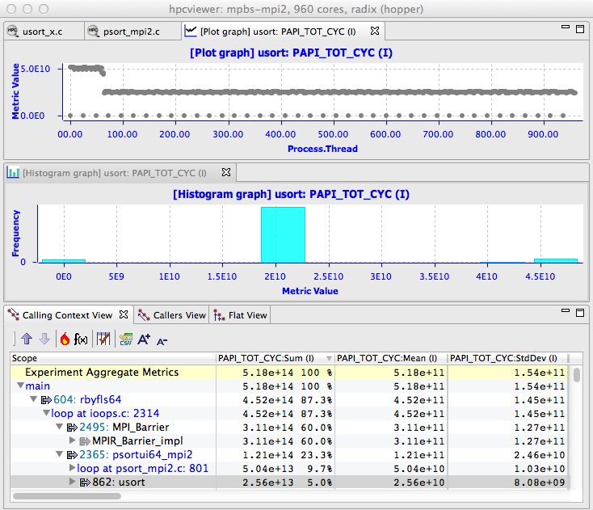
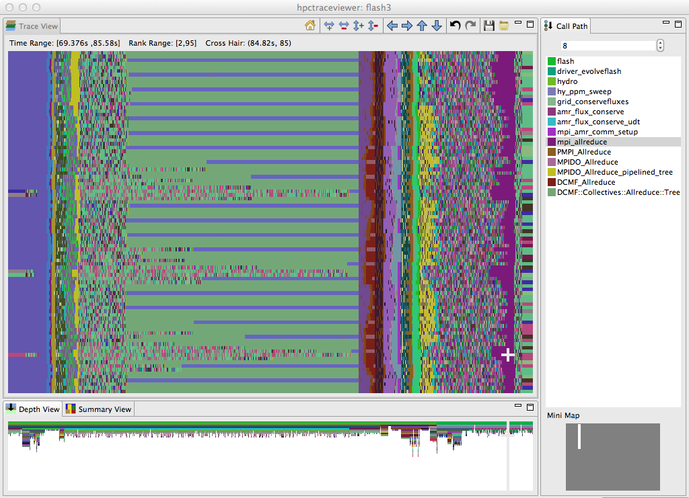

<!--
SPDX-FileCopyrightText: 2002-2023 Rice University
SPDX-FileCopyrightText: 2024 Contributors to the HPCToolkit Project

SPDX-License-Identifier: CC-BY-4.0
-->

# Introduction

HPCToolkit (Adhianto et al. 2010; Rice University, n.d.) is an integrated suite of tools for measurement and analysis of program performance on computers ranging from multicore desktop systems to the world's largest supercomputers.
HPCToolkit provides accurate measurements of a program's work, resource consumption, and inefficiency, correlates these metrics with the program's source code, works with multilingual, fully optimized binaries, has low measurement overhead, and scales to large parallel systems.
HPCToolkit's measurements provide support for analyzing a program execution cost, inefficiency, and scaling characteristics both within and across nodes of a parallel system.

HPCToolkit principally monitors an execution of a multithreaded and/or multiprocess program using asynchronous sampling, unwinding thread call stacks, and attributing the metric value associated with a sample event in a thread to the calling context of the thread/process in which the event occurred. HPCToolkit's asynchronous sampling is typically triggered by the expiration of a Linux timer or a hardware performance monitoring unit event, such reaching a threshold value for a hardware performance counter.
Sampling has several advantages over instrumentation for measuring program performance: it requires no modification of source code, it avoids potential blind spots (such as code available in only binary form), and it has lower overhead.
HPCToolkit typically adds measurement overhead of only a few percent to an execution for reasonable sampling rates (N. R. Tallent, Mellor-Crummey, and Fagan 2009).
Sampling enables fine-grain measurement and attribution of costs in both serial and parallel programs.

For parallel programs, one can use HPCToolkit to measure
the fraction of time threads are idle, working, or communicating.
To obtain detailed information about a program's computation
performance, one can collect samples using a processor's built-in performance monitoring
units to measure metrics such as
operation counts, pipeline stalls, cache misses, and data movement
between processor sockets. Such detailed measurements are essential
to understand the performance characteristics of applications
on modern multicore microprocessors that employ instruction-level
parallelism, out-of-order execution, and complex memory hierarchies.
With HPCToolkit, one can also easily compute derived metrics such as cycles
per instruction, waste, and relative efficiency to provide insight
into a program's shortcomings.

```{figure-md} fig:code-centric


A code-centric view of an execution of the University of Chicago's FLASH code executing on 8192 cores of a Blue Gene/P. This bottom-up view shows that 16% of the execution time was spent in IBM's DCMF messaging layer. By tracking these costs up the call chain, we can see that most of this time was spent on behalf of calls to `pmpi_allreduce` on line 419 of `amr_comm_setup`.
```

A unique capability of HPCToolkit is its ability to unwind the call stack of a thread executing highly optimized code to attribute time, hardware counter metrics, as well as software metrics (e.g., context switches) to a full calling context.
Call stack unwinding is often difficult for highly optimized code (N. R. Tallent, Mellor-Crummey, and Fagan 2009). For accurate call stack unwinding, HPCToolkit employs two strategies:
interpreting compiler-recorded information in DWARF Frame Descriptor Entries (FDEs) and binary analysis
to compute unwind recipes directly from an application's machine instructions.
On ARM processors, HPCToolkit uses `libunwind` exclusively. On Power processors, HPCToolkit uses
binary analysis exclusively.
On x86_64 processors, HPCToolkit employs both strategies in an integrated fashion.

```{figure-md} fig:thread-centric


A thread-centric view of the performance of a parallel radix sort application executing on 960 cores of a Cray XE6. The bottom pane shows a calling context for `usort` in the execution. The top pane shows a graph of how much time each thread spent executing calls to `usort` from the highlighted context. On a Cray XE6, there is one MPI helper thread for each compute node in the system; these helper threads spent no time executing `usort`. The graph shows that some of the MPI ranks spent twice as much time in `usort` as others. This happens because the radix sort divides up the work into 1024 buckets. In an execution on 960 cores, 896 cores work on one bucket and 64 cores work on two. The middle pane shows an alternate view of the thread-centric data as a histogram.
```

HPCToolkit assembles performance measurements into a call path profile that associates the costs of each function call with its full calling context.
In addition, HPCToolkit uses binary analysis to attribute program performance metrics with detailed precision -- full dynamic calling contexts augmented with information about call sites, inlined functions and templates, loops, and source lines.
Measurements can be analyzed in a variety of ways: top-down in a calling context tree, which associates costs with the full calling context in which they are incurred; bottom-up in a view that apportions costs associated with a function to each of the contexts in which the function is called; and in a flat view that aggregates all costs associated with a function independent of calling context.
This multiplicity of code-centric perspectives is essential to understanding a program's performance for tuning under various circumstances.
HPCToolkit also supports a thread-centric perspective, which enables one to see how a performance metric for a calling context differs across threads, and a time-centric perspective, which enables a user to see how an execution unfolds over time. Figures [1.1](#fig:code-centric)--[1.3](#fig:time-centric) show samples of HPCToolkit's code-centric, thread-centric, and time-centric views.

```{figure-md} fig:time-centric


A time-centric view of part of an execution of the University of Chicago's FLASH code on 256 cores of a Blue Gene/P. The figure shows a detail from the end of the initialization phase and part of the first iteration of the solve phase. The largest pane in the figure shows the activity of cores 2--95 in the execution during a time interval ranging from 69.376s--85.58s during the execution. Time lines for threads are arranged from top to bottom and time flows from left to right. The color at any point in time for a thread indicates the procedure that the thread is executing at that time. The right pane shows the full call stack of thread 85 at 84.82s into the execution, corresponding to the selection shown by the white crosshair; the outermost procedure frame of the call stack is shown at the top of the pane and the innermost frame is shown at the bottom. This view highlights that even though FLASH is an SPMD program, the behavior of threads over time can be quite different. The purple region highlighted by the cursor, which represents a call by all processors to `mpi_allreduce`, shows that the time spent in this call varies across the processors. The variation in time spent waiting in `mpi_allreduce` is readily explained by an imbalance in the time processes spend a prior prolongation step, shown in yellow. Further left in the figure, one can see differences among ranks executing on different cores in each node as they await the completion of an `mpi_allreduce`. A rank executing on one core of each node waits in `DCMF_Messager_advance` (which appears as blue stripes) while ranks executing on other cores in each node wait in a helper function (shown in green). In this phase, ranks await the delayed arrival of a few of their peers who have extra work to do inside `simulation_initblock` before they call `mpi_allreduce`.
```

By working at the machine-code level, HPCToolkit accurately measures and attributes costs in executions of multilingual programs, even if they are linked with libraries available only in binary form.
HPCToolkit supports performance analysis of fully optimized code.
It measures and attributes performance metrics to shared libraries that are dynamically loaded at run time.
The low overhead of HPCToolkit's sampling-based measurement is particularly important
for parallel programs because measurement overhead can distort program behavior.

HPCToolkit is also especially good at pinpointing scaling losses in parallel codes, both within multicore nodes and across the nodes in a parallel system.
Using differential analysis of call path profiles collected on different numbers of threads or processes enables one to quantify scalability losses and pinpoint their causes to individual lines of code executed in particular calling contexts (Coarfa et al. 2007).
We have used this technique to quantify scaling losses in leading science applications across thousands of processor cores on Cray and IBM Blue Gene systems, associate them with individual lines of source code in full calling context (N. R. Tallent et al. 2009; N. R. Tallent, Adhianto, and Mellor-Crummey 2010), and quantify scaling losses in science applications within compute nodes at the loop nest level due to competition for memory bandwidth in multicore processors (N. Tallent et al. 2008).
We have also developed techniques for efficiently attributing the idleness in one thread to its cause in another thread (N. R. Tallent and Mellor-Crummey 2009; N. R. Tallent, Mellor-Crummey, and Porterfield 2010).

HPCToolkit is deployed on many DOE supercomputers, including
the Sierra supercomputer (IBM Power9 + NVIDIA V100 GPUs) at Lawrence Livermore National Laboratory,
Cray XC40 systems at Argonne's Leadership Computing Facility and the National Energy
Research Scientific Computing Center; the Summit supercomputer (IBM Power9 + NVIDIA V100 GPUs) at Oak Ridge Leadership Computing Facility
as well as other clusters and supercomputers based on x86_64, Power, and ARM processors.
